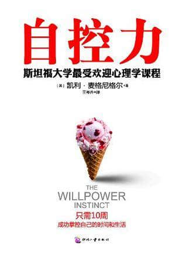
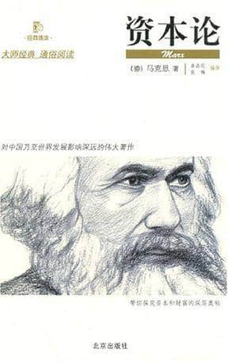
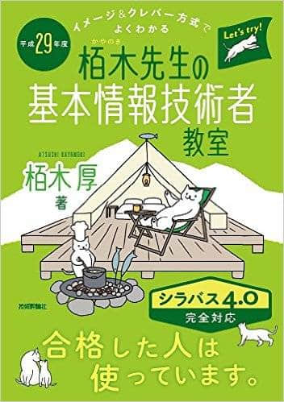
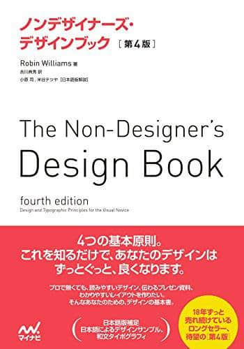
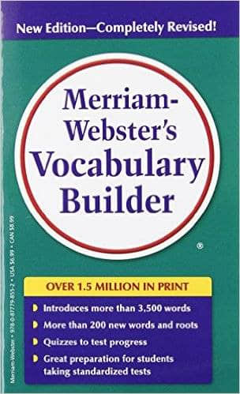

+++
author = "Zhou Fang"
title = "2017 年 2 月书单"
date = "2017-02-28"
updated = "2017-02-28"
category = "阅读时光"
tags = [
    "书单",
]
+++

# 本月看的书
1. **『自控力』**

一本很实用的书，这本书彻底改了我一个多年的坏习惯。并且，现在在面对各种诱惑时，自我感觉能够更加科学的去自控了。
作者用了很多科学研究的结论，从多方面来分析失控的原因，对于自控这件事，确实是有极大的帮助的。比如「道德许可」及「那有如何」心理现象，深有感触。书中甚至对于商业上的心理失控也有触及。由于引用了非常多的实例，读起来也算饶有趣味。
<!--more-->

1. **『资本论』**

就如马克思在文中所说，经济学如今已经不是一门新科学了，早已融入生活之中。看资本论就像小时候父母解释钱的价值一般，虽然有时候有点难理解，但还是很有意思的。

# 本月购置的书籍

1. 『栢木先生の基本情報技術者教室』[Amazon Japan](http://amzn.asia/5bE08mh)
    
    也不知道好不好，备考「基本情報技術者」资格认定的书。
2. 『ノンデザイナーズ・デザインブック』[Amazon Japan](http://amzn.asia/07SOjt7)
    
    英文名：The Non-Designer’s Design Book 彩页比较多，覆盖了各个方面的设计，就当是业余设计入门的书来看吧。
3. 『Merriam-Webster‘s Vocabulary Builder』[Amazon Japan](http://amzn.asia/9y6kCTC)
    
    高中时候挺多人买的，可那时候对英语不上心。现在乘着假期，买回来慢慢学习。