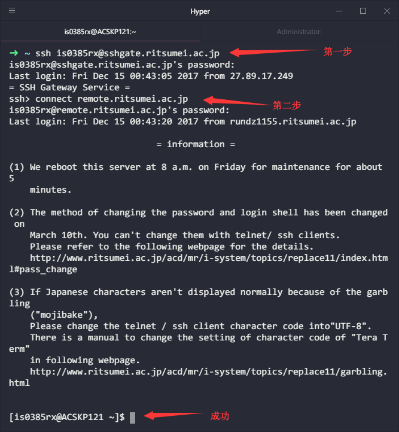
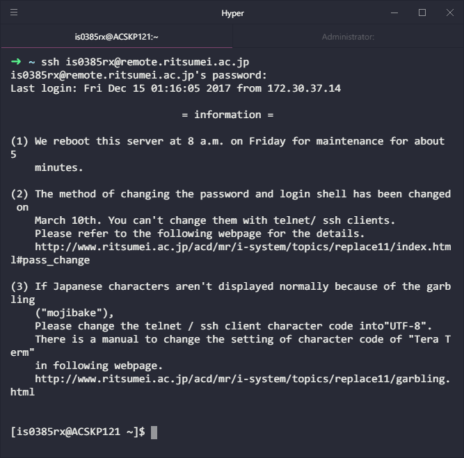
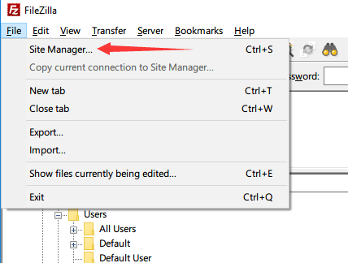
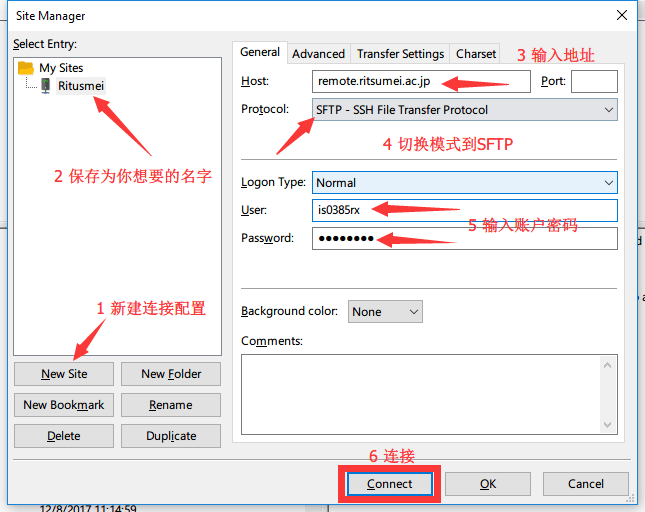
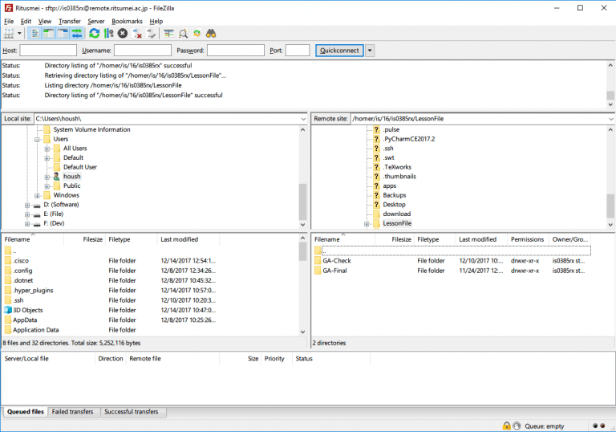

+++
author = "Zhou Fang"
title = "从校外快速连接到立命馆"
date = "2017-12-15"
updated = "2017-12-15"
category = "软件心得"
tags = [
    "立命馆",
    "SSH",
]
+++

# 背景
很多人都喜欢在家里写作业，但是碍于部分开发环境的配置过于繁琐，大家都想通过校内的 Rainbow 环境下的预配置 CentOS 来完成。同时，身处日本国外时，若想利用学校的证书去访问付费论文数据库，也需要利用到立命馆提供的网络服务。
在这里，就从**立命馆 VPN**，**RAINBOW Linux**，**校内文件传输**三个方面来介绍一下立命馆的网络服务。

# 立命馆服务管理
考虑到安全性，立命馆所有高级网络功能均要求手动开启。
请登入学校的 [服务管理页面](https://idminfo.ritsumei.ac.jp/webmtn/sso-joint) 开启 SSH 及 VPN 服务。

**小提示** 点击左侧「ユーザ設定 (User Settings)」即可切换到服务开关页面。
<!--more-->

# 立命馆 VPN
一个采用 Cisco AnyConnect 技术的 VPN。个人是非常推荐使用的，客户端跨越全平台。同时由于该技术广泛应用于跨国企业和高等院校，就算回国也能正常使用，不会被封锁。

## 客户端下载
Windows / macOS: [通过立命馆下载](https://sslvpn.ritsumei.ac.jp/)（Download 栏目中有个蓝色链接）
iOS：[日本 AppStore](https://itunes.apple.com/jp/app/cisco-anyconnect/id1135064690) [中国 AppStore](https://itunes.apple.com/cn/app/cisco-anyconnect/id1135064690) [美国 AppStore](https://itunes.apple.com/us/app/cisco-anyconnect/id1135064690)
Android: [Play 商店](https://play.google.com/store/apps/details?id=com.cisco.anyconnect.vpn.android.avf&hl=zh-cn)

## 连接
1. 设定连接地址为「sslvpn.ritsumei.ac.jp」
2. 点击 **连接**
3. 用 Rainbow 账号密码验证

# 远程使用 CentOS

> Secure Shell（安全外壳协议，简称 SSH）是一种加密的网络传输协议，可在不安全的网络中为网络服务提供安全的传输环境。SSH 通过在网络中建立安全隧道来实现 SSH 客户端与服务器之间的连接。虽然任何网络服务都可以通过 SSH 实现安全传输，SSH 最常见的用途是远程登录系统，人们通常利用 SSH 来传输命令行界面和远程执行命令。
> --- [Secure Shell - 维基百科，自由的百科全书](https://zh.wikipedia.org/wiki/Secure_Shell)

## 准备工作
对于 macOS 和 Linux 用户来说，SSH 属于内置功能，不需要额外配置。

Windows 10 最新版本也已经支持了 OpenSSH，直接可以使用。也可以通过子系统访问。Windows 10 子系统的安装可以参考我的另外一篇文章『[在 Windows 中使用 Linux 子系统]()』。

如果你是旧版本的 Windows 用户，你需要自行安装 Win32-OpenSSH 来使用 SSH，在此不再赘述。

## SSH 使用注意点
在初次连接 SSH 时会询问「要添加证书么」，输入「y」 或「yes」来表示同意并继续即可。
请记住，用 SSH 的时候请务必带上你的用户名！

连接上去之后，是没有 GUI（图形用户界面）的，一切都要靠命令行来操作。
你可以在本地把代码写完，然后通过后面提到的方式同步到你的 CentOS 内执行。
不过还是建议在使用前查阅 vi 或者是 emacs 这一类运行在命令行上的编辑器的指令后再登陆使用。

## 方式一
首先介绍一种较为简单的纯命令行方式。
1. 跨过校内 ssh 防火墙，以我的学号 `is0385rx` 为例
```shell
ssh is0385rx@sshgate.ritsumei.ac.jp
```
1. 连接到 CentOS 环境

```shell
connect remote.ritsumei.ac.jp
```


## 方式二
1. 用前面提到的 Cisco AnyConnect 连接前文提到的立命馆 VPN。
2. 连接到 CentOS。（以我的学号 `is0385rx` 为例）
```shell
ssh is0385rx@remote.ritsumei.ac.jp
```


# 取得校内机器上的文件
恭喜！你已经连接到了校内 Linux 环境之中。如果你熟悉命令行操作的话，现在应该已经可以开始大展拳脚了。但是如果想获取到校内 Linux 上文件的话，CLI 还是非常的难以使用，这时候就需要文件管理工具来帮助我们。

## 准备工作
下载安装免费好用还全平台支持的传输软件 [Filezilla](https://filezilla-project.org/download.php?type=client)。
**不需要 Pro 版本**，普通版本就足够强大。**在安装过程中可能会安装 2 个广告软件，请取消勾选。**

## 连接
1. 连接前文提到的立命馆 VPN。
   如果已经连接到校内 Wi-Fi 的话不需要
2. 打开 Filezilla 的 站点管理器
   
3. 添加数据如下
   
4. 第四步，连接
   在第一次连接时和 SSH 命令连接一样，都会有添加证书的一步，点击「yes」即可。
   

大功告成，现在你已经可以随意操作到学校的 Rainbow 环境了。