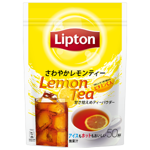
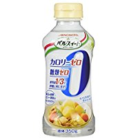
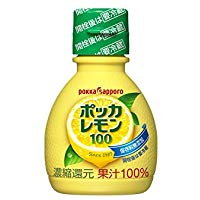

+++
author = "Zhou Fang"
title = "在日生活之维他柠檬茶冲调攻略"
date = "2018-06-24"
updated = "2018-06-24"
category = "料理生活"
tags = [
    "维他柠檬茶",
    "饮料调制"
]
+++

日本生活多年，忘不了国内维他柠檬茶的同学相信有不少。
但是无论是国内转运还是人肉带货价格都非常的高昂，所以就萌生了自己冲调的想法。
这周算是 fork 了许同学的冲调法，自己进行了冲调比例的多次尝试，以求尽量接近维他的口感。
<!--more-->
# 工具准备
1. 1L 以上瓶体容器
一般的水壶都可以，顺便一提我是从亚马逊购入的，壶口开闭很方便。
[HARIO 1400ml 水壶](http://amzn.asia/7NZPhhA)
2. 量勺
我是从 FLET’s 百元店购入的，15ml 和 5ml 两只装。

# 材料准备
1. 立顿柠檬茶粉（リプトン さわやかレモンティー）
   
    各大超市，业务超市都有售。
    在线购买：
    [日本立顿官方商店](https://item.rakuten.co.jp/lipton-brooke/10001286/) | [亚马逊](https://www.amazon.co.jp/s/field-keywords=リプトンさわやかレモンティー)
    价格：513 元 / 500g（税后）

2. 大正制药液态果糖（パルスイート カロリーゼロ）
    
    各大超市都有售。
    在线购买：[亚马逊](https://www.amazon.co.jp/s/ref=nb_sb_noss?__mk_ja_JP=カタカナ&#038;url=search-alias%3Daps&#038;field-keywords=パルスイート+カロリーゼロ+液体)
    价格：631 元 / 500g（税后）
    只要是液态果糖都可以，不一定要一个牌子的，只是用量上需要自己把握。

3. Pokka 柠檬汁（ポッカレモン 100）
    
    各大超市，业务超市都有售。
    在线购买：
    [亚马逊](https://www.amazon.co.jp/s/field-keywords=ポッカレモン 100)
    价格：70ml 塑料小瓶装 1000 元 / 500ml（税后）| 450ml 玻璃大瓶装 480 元 / 500ml（税后） 

# 冲调方法
1. 直接加入冷水 1L 于壶中。
建议使用「KIRIN アルカリイオンの水」，不贵，使用后无任何杂味。
当然，自来水 / 开水也是可以的。
2. 添加 **15ml** x 7 勺 的柠檬茶粉
柠檬茶粉的多少取决你对涩味的敏感度。
建议第一次照做，之后可酌量减少或者增加。
3. 混合均匀
如果你觉得比较难搅匀，可以先用其他容器先接出一半，然后大力摇晃搅匀。
如果有摇壶的话建议直接分两次调匀后放入瓶中。
4. 添加 **5ml** x 6.5 勺 的果糖
该甜度大概为国内奶茶 10 分糖的甜度，可以酌量减少。
维他的甜度大概需要加入 5.5 勺。
5. 混合均匀
稍微摇一下，使用液态果糖的主要理由就是为了快速混合。
6. 添加柠檬汁
这一步其实是非常主观的，主要是如何为柠檬茶添加适量的酸味。
建议每 5ml 搅匀先自己尝一下再决定是否继续添加。我一般是加入 25ml。
7. 放入冰箱静置半小时以上


在炎炎夏日，喝着冰镇的柠檬茶，真是爽的不行。