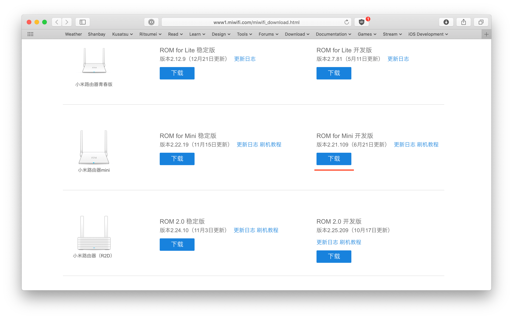
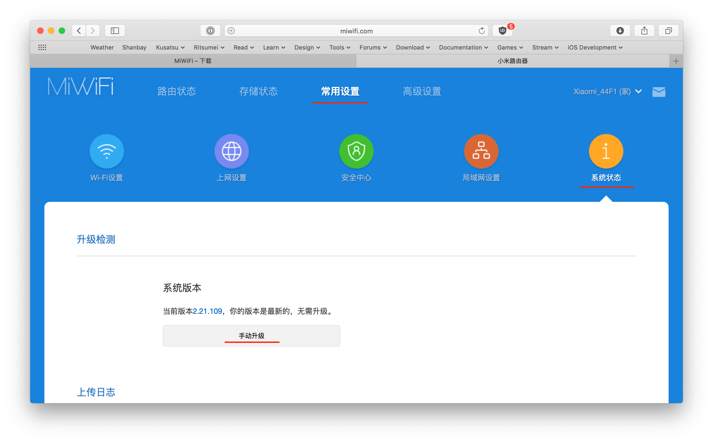
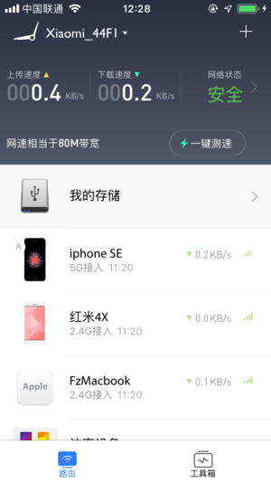
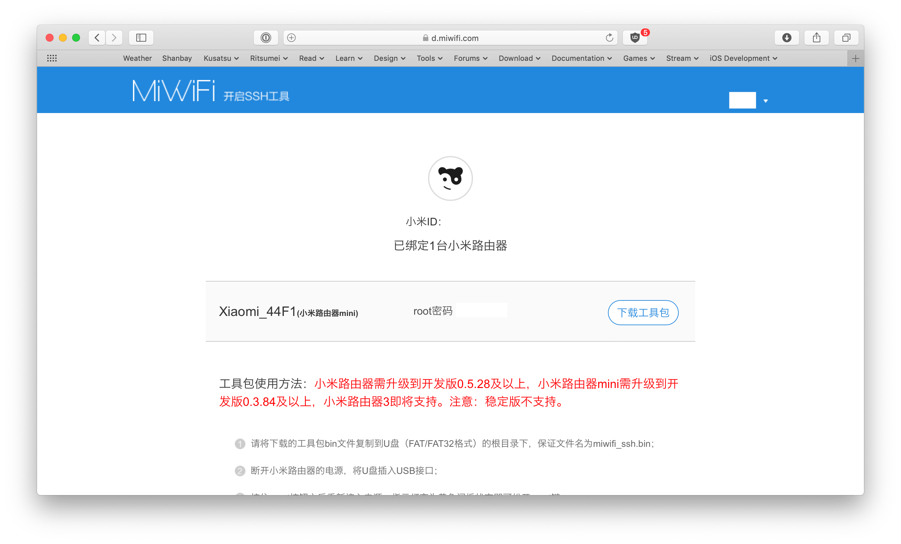
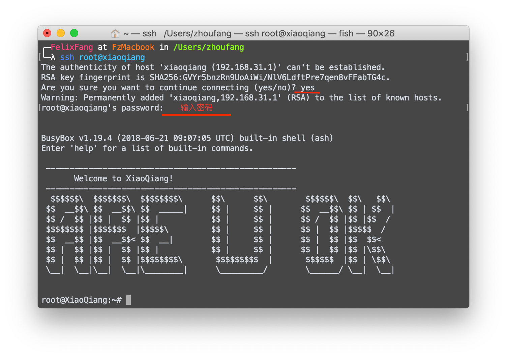
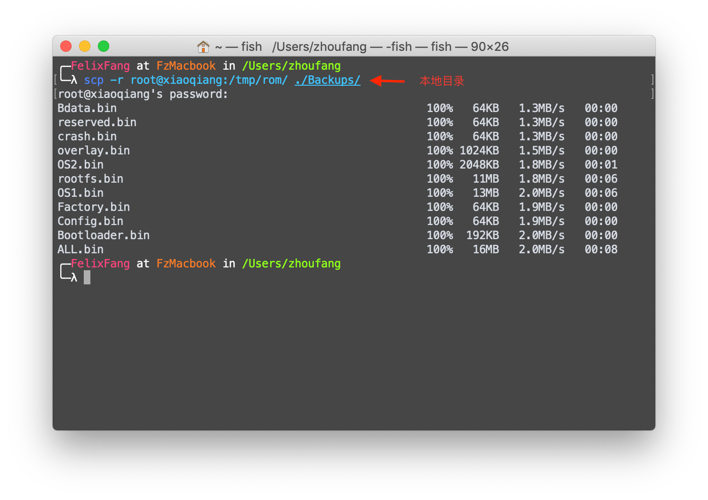
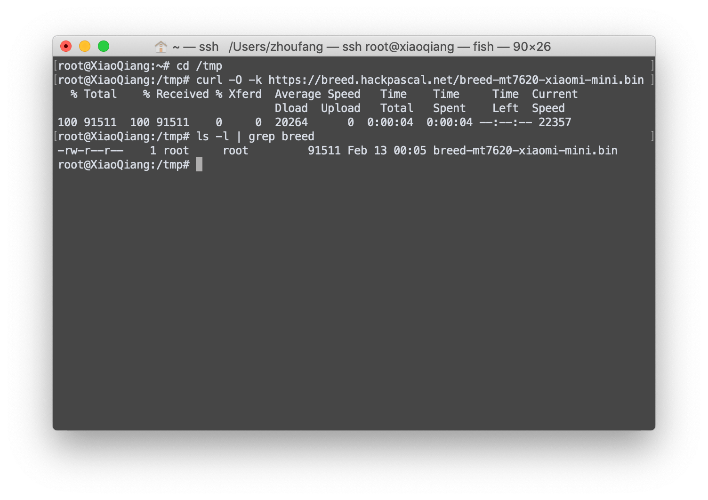
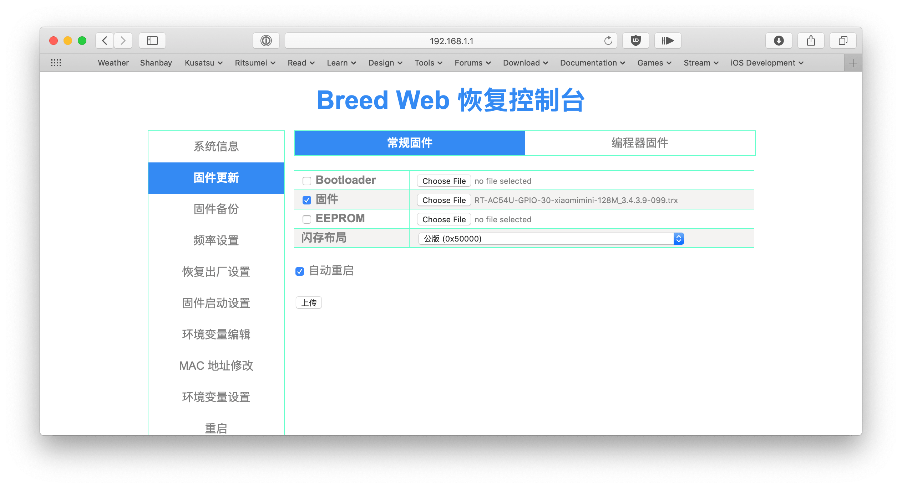
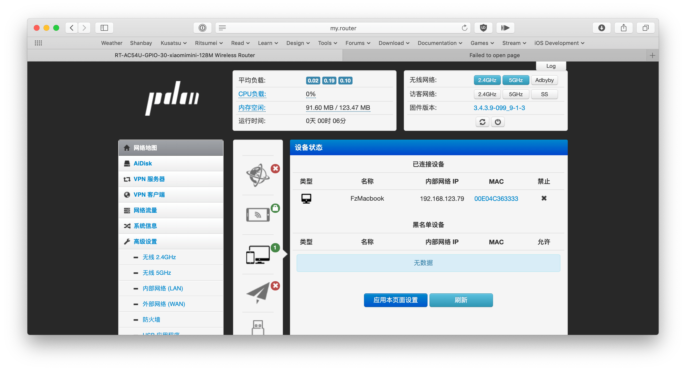

+++
author = "Zhou Fang"
title = "在小米路由器 Mini 上安装 Pandavan 固件"
date = "2019-02-14"
updated = "2019-02-14"
category = "操作系统"
tags = [
    "路由器",
    "Pandavan",
]
+++


# 为什么要折腾这一下
现在中国大陆的网站对于海外的访问限制力度非常之大，传统的突破封锁的方法很多都无法奏效。事已至此，还是和国内爱国上网一样，借由 Shadowsocks 回国吧。手上虽然有一台腾讯云的云服务器，但是带宽就 1M，日本连过去的线路还很善变，速度及其不稳定，丢包率奇高无比。上次在 V2EX 问了一些网友，在国内家里用路由器搭建一个 Shadowsocks 服务端却是一个可以价格低廉且稳定的方案。
想配置家里这个路由器已经第 3 年了，每次回国都忘记，今天总算被我想了起来。

**更新**：忘了现在国内 IPv4 地址不够了，Shadowsocks 服务端开不了了。只能等以后 IPv6 地址有了之后再弄了。但是总体来说，可以给家中长辈添加视频去广告，以及根据 gfwlist 爱国上网等等功能也是很不错的。

# 准备
查了下资料，我房间内的这个小米路由器 Mini 是比较容易把玩的一个路由器型号。在二手市场的价格也已经接近谷底（40 包邮），如果手上没有的话，也很推荐去淘宝买一个。
- 小米路由器 × 1
- 小米网络账户 × 1
- U 盘 × 1 （16M 空余空间就行）
- 网线 × 1
- 手机 × 1
- 用网线上网的设备 × 1
<!-- more -->

# 操作顺序
## 开启开发权限
1. 下载小米路由器官方的开发版固件。[下载链接](http://www1.miwifi.com/miwifi_download.html)
    小米为路由器本身就提供了开发版，便于爱好者折腾，从这点来说，我觉得非常棒！
    

2. 刷入小米路由器官方的开发版固件。
    登陆到路由器后台，一般来说连入小米路由器之后直接访问 `miwifi.com` 就行。
    选择路由器控制面板内的手动升级功能来完成开发版固件刷入工作。
    

3. 用手机 App 「小米WiFi」设定路由器到正常上网状态，并绑定这个路由器到你的小米账户上。
   

4. 安装 SSH 工具包。
    在 [这里](https://d.miwifi.com/rom/ssh) 可以直接下载到 SSH 工具包和对应的 root 密码。
    

5. 按照官方操作指导 U 盘刷入 SSH 工具包。
    ① 将下载的工具包 bin 文件复制到U盘（FAT/FAT32 格式）的根目录下，保证文件名为 `miwifi_ssh.bin`
    ② 断开小米路由器的电源，将U盘插入 USB 接口；
    ③ 按住 `reset` 按钮之后重新接入电源，指示灯变为黄色闪烁状态即可松开 `reset` 键；
    ④ 等待3-5秒后安装完成之后，小米路由器会自动重启。

6. 用 ssh 登入路由器的 Linux 系统。
    小米路由器的默认网络别名是 `xiaoqiang`，默认 SSH 端口为 22。
    ```bash
    ssh root@xiaoqiang
    ```
    看到「ARE U OK」就算是成功进入了。
    

## 备份官方固件
1. 首先，通过 SSH 连接到小米路由器之后，就可以用 `cat /proc/mtd` 查看当前固件的信息了。
    ```bash
    root@XiaoQiang:~# cat /proc/mtd
    dev:    size   erasesize  name
    mtd0: 01000000 00010000 "ALL"
    mtd1: 00030000 00010000 "Bootloader"
    mtd2: 00010000 00010000 "Config"
    mtd3: 00010000 00010000 "Factory"
    mtd4: 00c80000 00010000 "OS1"
    mtd5: 00b178a7 00010000 "rootfs"
    mtd6: 00200000 00010000 "OS2"
    mtd7: 00100000 00010000 "overlay"
    mtd8: 00010000 00010000 "crash"
    mtd9: 00010000 00010000 "reserved"
    mtd10: 00010000 00010000 "Bdata"
    ```
    看好列表后，马上就依次备份现有的文件。
    ```bash
    cd /tmp
    mkdir rom
    dd if=/dev/mtd0 of=/tmp/rom/ALL.bin
    dd if=/dev/mtd1 of=/tmp/rom/Bootloader.bin
    dd if=/dev/mtd2 of=/tmp/rom/Config.bin
    dd if=/dev/mtd3 of=/tmp/rom/Factory.bin
    dd if=/dev/mtd4 of=/tmp/rom/OS1.bin
    dd if=/dev/mtd5 of=/tmp/rom/rootfs.bin
    dd if=/dev/mtd6 of=/tmp/rom/OS2.bin
    dd if=/dev/mtd7 of=/tmp/rom/overlay.bin
    dd if=/dev/mtd8 of=/tmp/rom/crash.bin
    dd if=/dev/mtd9 of=/tmp/rom/reserved.bin
    dd if=/dev/mtd10 of=/tmp/rom/Bdata.bin
    ```

    你可以直接用上面的代码一行行进去执行，也可以存成 `sh` 文件，用 `chmod +x <文件名> && ./<文件名>` 的格式可以更加方便的运行。
            
2. 把备份文件拖回本地
    用 `exit` 退出小米路由器的 shell 环境。
    在本地执行下面的代码即可下载全部的文件。
    ```bash
    scp -r root@xiaoqiang:/tmp/rom/ <备份目录>
    ```
    
    我这样操作后，`Backups` 文件夹中就会多出一个 `rom` 目录，里面存放了全部备份文件。

3. 备用恢复命令
    如果日后想要恢复现在的文件，那么就可以用下面的语句上传我们的包到路由器的临时目录里。
    ```bash
    scp -r <备份目录> root@xiaoqiang:/tmp/
    ```
    这个地方备份目录要以 `/rom/` 结尾，这样 scp 复制到服务器上的 `tmp` 目录中 就会有一个 `rom` 文件夹。
    在确认所有备份已经上传至小米路由器的 `/tmp/rom` 中之后，即可使用下面的命令恢复了。
    ```bash
    mtd write /tmp/rom/Bootloader.bin Bootloader
    mtd write /tmp/rom/Config.bin Config
    mtd write /tmp/rom/Factory.bin Factory
    mtd write /tmp/rom/OS1.bin OS1
    mtd write /tmp/rom/rootfs.bin rootfs
    mtd write /tmp/rom/OS2.bin OS2
    mtd write /tmp/rom/overlay.bin overlay
    mtd write /tmp/rom/crash.bin crash
    mtd write /tmp/rom/reserved.bin reserved
    mtd write /tmp/rom/Bdata.bin Bdata
    ```
## 刷入国产 Breed
Breed，一款出自国内著名路由器技术社区——恩山论坛的一款 BootLoader。主要特点还是便于刷机，其支持 Web 页面提交刷机包完成刷机，很受国内玩家追捧。下面，我就来安装 Breed 到小米路由器上。
1. 下载最新版本的 Breed。
    作者 Hackpascal 将其制作的 Breed 放于个人服务器供大家分享使用，虽是不开源产品，但是基本上覆盖了市面上大部分热门机型，小米路由器 Mini 自然也不例外。
    打开 [Breed 下载站](https://breed.hackpascal.net)，找到 `breed-mt7620-xiaomi-mini.bin` 右键复制其下载链接。
    用 SSH 连接上小米路由器，使用 `curl` 来下载 Breed 到临时目录 `/tmp` 中。
    

2. 覆盖写入 Breed 到 BootLoader。
    在 `/tmp` 目录下执行下面的代码即可刷入 Breed。
    ```bash
    mtd -r write breed-mt7620-xiaomi-mini.bin Bootloader
    ```
3. 刷入后，机器会重新启动，指示灯变蓝。
    这个过程比较耗时，约 20 分钟，请一定要等到指示灯变蓝。

4. 将电脑设定为自动获取 IP 地址，且是用物理网线连上路由器。

5. 进入 Web 刷机模式
    先断开小米路由器的电源，用牙签等尖锐物按下路由器 `reset` 按钮后重新接入电源。
    等到路由器的蓝色灯开始闪烁时即表明进入 Web 刷机模式，松开 `reset` 键。
    此时，使用浏览器登入 `192.168.1.1`，即可进入 Breed 的控制台。

## 上传并刷入 Padavan
终于到了最后一步，刷入 Padavan。
Padavan 是由恩山无线论坛的 hiboyhiboyhiboy 出品的一款开源路由器固件改版，调整了很多符合国人习惯的设定，开箱即用，备有非常多的常用软件。可以说，在易用性上远超市面上其他所有固件。
[Padavan 发布原帖](https://www.right.com.cn/forum/thread-161324-1-1.html) | [Padavan 官方信息发布 TG 群](http://t.me/pdcn1)| [Padavan 固件下载列表](http://opt.cn2qq.com/padavan/)

1. 登入 Breed 的 Web 刷机控制台。
    地址栏输入 `192.168.1.1` 即可。
2. 选择左侧的「固件升级」，选择固件为刚刚下载的 `trx` 文件。
   
3. 开始刷入，等待刷机结束。

## 进入 Padavan 控制台
默认登陆地址为 `http://my.router`，默认账户和密码都是 `admin`，可以自行修改。

关于具体设置的话，由于 Padavan 做的实在是完善，在 WebUI 的指引下就可以轻松设定好一切。更多的用法请各位自己去探索吧！

# 参考资料
- [【开学季】宿舍神器小米路由mini刷Padavan（带锐捷认证）](http://bbs.xiaomi.cn/t-32939238)
- [scp从服务器下载文件到本地或从本地上传文件到服务器](https://www.jianshu.com/p/b2849c92861b)
- [Boot and Recovery Environment for Embedded Devices (BREED)](https://breed.hackpascal.net)
- [Does curl have a --no-check-certificate option like wget?](https://unix.stackexchange.com/questions/60750/does-curl-have-a-no-check-certificate-option-like-wget)