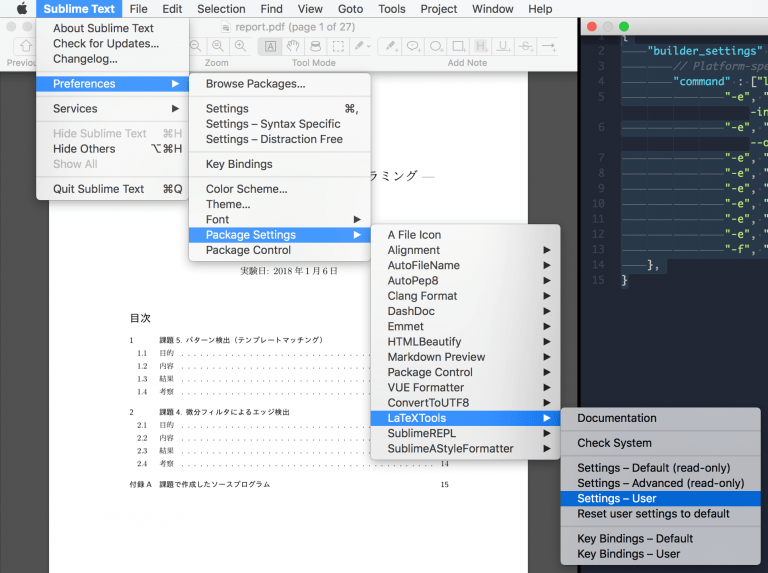

+++
author = "Zhou Fang"
title = "LaTeX + Sublime Text 日文环境配置 macOS 篇"
date = "2017-12-13"
updated = "2017-12-13"
category = "软件心得"
tags = [
    "LaTeX",
    "platex",
    "日语论文",
]
+++
  
本文适用于采用 macOS 操作系统的用户，如果你是 Windows 用户，请参考『[这篇文章]()』。

# 前言
LaTeX 是理工系同学在写日常报告和论文时不可或缺的伙伴，相比于传统的文字处理软件，可以更加方便的排版和书写公式。在日本的大学之中，使用 LaTeX 书写也是一门必备的技巧。随着 MacTeX 的更新，日文环境已经足够完善，但是为了更加快速的书写及编译 LaTeX 文档，我们可以对相关软件进行设置来提升使用体验。
本文旨在帮助无电脑基础的读者在 Mac 上快速建立起日文 LaTeX 书写环境，并和 Sublime Text 3 进行配合，进一步提升书写的舒适度。
强烈推荐 Skim 阅读器，能够动态读取 PDF 文档，并对刚刚作出修改的地方进行同步标示。
<!--more-->

# 准备

> **终端**：Terminal，ターミナル
> **ST3**：Sublime Text 3 （一款非常好用的文本编辑器，免费）。
> **Launchpad**：苹果自带的应用启动器。

在安装及配置之前，我们需要先准备好一些文件。其中部分文件较大，建议先行下载。
1. 前往 TeX Live 官方网站的 [MacTex 专区](http://www.tug.org/mactex/mactex-download.html) 下载最新版本的 MacTex 发行版。
    **但是请先不要安装**
2. 前往 [Sublime Text 3 官方网站](https://www.sublimetext.com/3)，下载最新版本的 Sublime Text 3。
3. 前往 [Skim 官方网站](http://skim-app.sourceforge.net)，下载最新版本的 Skim 阅读器。

打开的你的终端，如果你找不到，可以尝试在屏幕底部的程序栏（Dock）中点开小火箭（Launchpad），直接输入「ter」你应该就能找到。

# 安装
像常规 Mac 软件一般，分别安装 Skim 以及 Sublime Text 3。由于不会出现什么特殊的问题，在此就略过不表了。
为了提升 TeX 的编译中对图片的转换功能，我们可以采用 Homebrew 来安装所需库。

Homebrew 是一个可以帮助你在 Mac 上快速安装/卸载/升级各种软件包的一个包管理器。

通过下面的命令来安装 Homebrew，在安装时，可能会被询问是否安装，输入 `y` 确认即可。

```bash
/usr/bin/ruby -e "$(curl -fsSL https://raw.githubusercontent.com/Homebrew/install/master/install)"
```

接着，我们就可以借助 Homebrew 来快速安装所需的 Ghostscript 及 ImageMagick。

```bash
brew install imagemagick
brew install ghostscript
```

在完成 Homebrew 相关的操作之后，我们打开 MacTeX 的安装包进行安装，在安装过程中，请注意有安装时有部分功能可以**自定义（英：Customize, 日：カスタマイズ）**，请去除勾选 Ghostscript 及 Convert-IM，这两个功能已经由我们在上面通过 Homebrew 来安装了。

# 配置
**配置部分为此文最为麻烦的部分，请有耐心的进行阅读和操作。**
## 为 ST3 安装 LaTeX 插件
如果之前你没有为 ST3 安装 Package Control（包管理器），请遵从下面的步骤安装，如果你安装过了，请跳过。
1. 通过 ST3 的菜单栏「View」-「Show Console」打开 ST3 的终端。
2. 打开 [Package Control 官网](https://packagecontrol.io/installation")，复制安装代码至 ST3 的终端。
3. 回车运行，等待数秒后，即安装完毕。

现在你可以通过按住 **Command+Shift+P** 组合键来开启 Package Control。在 Package Control 中键入「install」后即可定位到安装包的功能。


此时，如果你输入软件包名，Package Control 会自动去库中搜索。在搜索到包之后，按下回车键表示安装。
现在，通过 Package Control 安装「ConvertToUTF8」，「LaTeXTools」两个包。前者可解决中日韩文字编码问题，后者可用于自动化编译 LaTeX。

## 部署用于日语环境中的 LaTeXTools
通过总屏幕左上角的 **Sublime Text** ，可以开启 ST3 的菜单选项。
选择 Preferences ▸ Package Settings ▸ LaTeXTools ▸ Setting ▸ User 来打开 LaTeXTools 的用户配置文件。



第一次打开，会有提示是否要复制默认配置，随意选择即可。
接下来，将配置内容全部清空，并复制如下代码。
```json
{
    "builder_settings" : {
        "command" : [
            "latexmk", "-cd",
            "-e", "$latex = 'platex -synctex=1 -src-specials -interaction=nonstopmode'",
            "-e", "$biber = 'biber %O --bblencoding=utf8 -u -U --output_safechars %B'",
            "-e", "$bibtex = 'pbibtex %O %B'",
            "-e", "$makeindex = 'makeindex %O -o %D %S'",
            "-e", "$dvipdf = 'dvipdfmx %O -o %D %S'",
            "-e", "$pdf_mode = '3'",
            "-e", "$pdf_update_method = '0'",
            "-e", "$pdf_previewer = 'open -a preview.app'",
            "-f", "-norc", "-gg", "-pdfdvi"
        ],
    },
}
```
按下 Command + S 即可保存（或是点击菜单 File ▸ Save 来保存）。

## 配置 Skim
在配置之前，我们需要将 ST3 绑定至命令「subl」上。打开终端，运行下面的命令，即可完成绑定。

```bash
ln -s "/Applications/Sublime Text.app/Contents/SharedSupport/bin/subl" /usr/local/bin/subl
```

打开 Skim，在左上角苹果系统图标旁可以找到 Skim，点开，找到首选项（Preferences）进入。

  
将 Sync 选项卡中将 Skim 设定为自动重载，且同步于 Sublime Text。

大功告成，现在你可以用 Sublime Text 3 打开 tex 文件来编辑 LaTeX 了。
由于我们已经导入了最新版本的转换功能，可直接在 Tex 文书中插入大部分常见格式的图片而无需转换 eps 格式。
在 Tex 文书写完之后，按住 **Command+Shift+B** 组合键即可编译。
* * *
# 一些小技巧
## 图片快速转换
相信在日常写报告或是论文的时候，经常需要借助图片来展示实验的数据，操作及结果，以提升阅读的体验。然而，五花八门的图片格式往往阻挠了我们快速添加进入 LaTeX。
诚然，有许多常用的库可以帮助我们在编译时自动转换，但是为了 LaTeX 图片的一致性（比如我有几门课的老师一定要 eps 格式），我们可以使用之前通过 Homebrew 所安装的 ImageMagick 来快速转换他们。
在终端中输入命令，格式如下：

```bash
convert <原始文件> <转换后的文件>
```

**例：**
假设有张图「my.png」通过下面的语句就可以转换为 eps 格式。

```bash
convert my.png my.eps
```

# 参考资料

  1. [【2014 年版】『MacTex 2013』と『Sublime Text 2』で pLaTeX 環境をつくる](http://www.moxbit.com/2014/03/mac-tex-st2-latex-2014.html)
  2. MacTex 中自带的日语帮助手册
