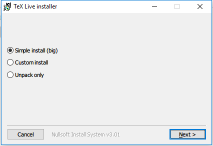
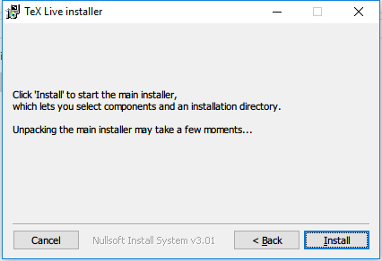
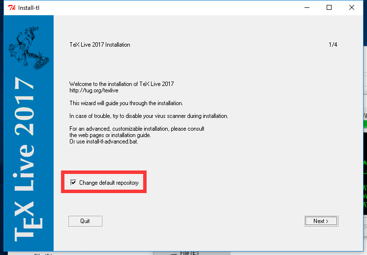
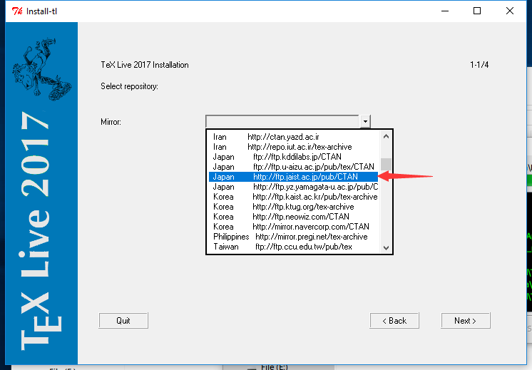
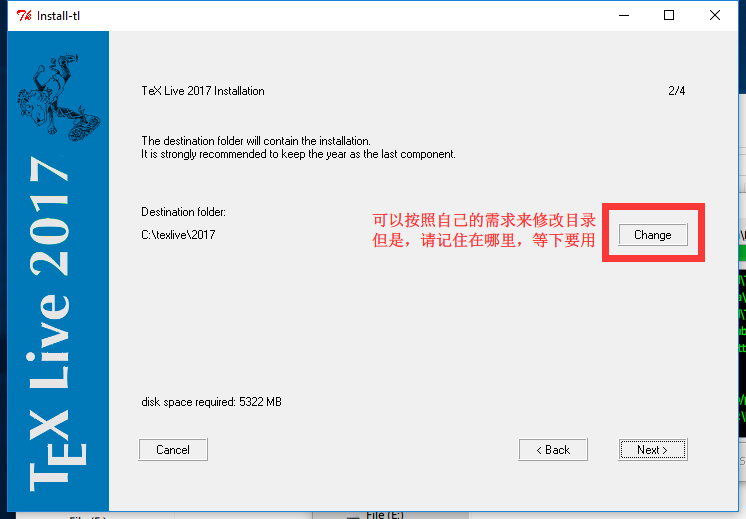
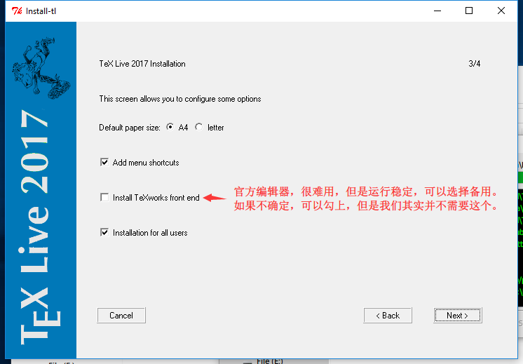
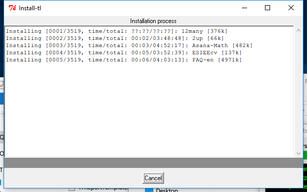
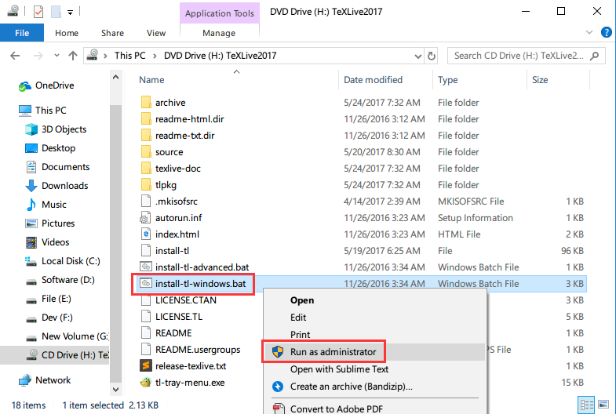
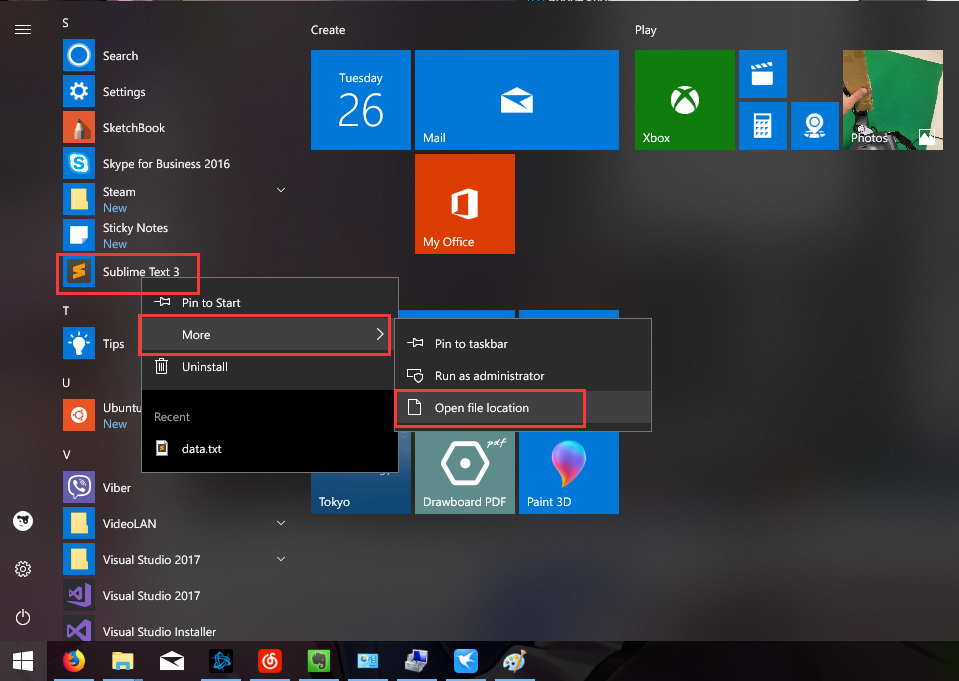
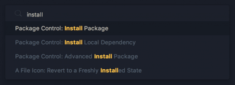

+++
author = "Zhou Fang"
title = "LaTeX + Sublime Text 日文环境配置 Windows 篇"
date = "2017-12-25"
updated = "2017-12-25"
category = "软件心得"
tags = [
    "LaTeX",
    "platex",
    "日语论文",
]
math = true
+++
  
本文适用于采用 Windows 操作系统的用户，如果你是 macOS 用户，请参考『[这篇文章]()』。

# 前言
LaTeX 是理工系同学在写日常报告和论文时不可或缺的伙伴，相比于传统的文字处理软件，可以更加方便的排版和书写公式。在日本的大学之中，使用 LaTeX 书写也是一门必备的技巧。上次写了一篇 macOS 下配置 LaTeX 的文章，考虑到 Windows 用户的基数庞大，就借此文向大家介绍一下在 Windows 系统下快速配置 LaTeX 的心得。
本文旨在帮助无电脑基础的读者在 Windows 上快速建立起日文 LaTeX 书写环境，并和 Sublime Text 3 及 Sumatra PDF 阅读器进行配合，进一步提升书写的舒适度。

<!--more-->
# 准备

> **ST3**：Sublime Text 3 （一款非常好用的文本编辑器，免费）。

注：后文图片较多，可点击查看大图。
在安装及配置之前，我们需要先准备好一些文件。其中部分文件较大，建议先行下载。
下载部分软件时，可自由选择 32 位或是 64 位，无影响。本文采用的均为 64 位版本。

1. 前往 [Sublime Text 官方网站](https://www.sublimetext.com/3)，下载最新版本的 Sublime Text 3。
Sublime Text 3 有安装版本也有绿色版本（Portable）。可以根据自己的需要来选择。
2. 前往 [Sumatra 官方网站](https://www.sumatrapdfreader.org/download-free-pdf-viewer.html)，下载最新版本的 Sumatra PDF 阅读器。

# 安装 TeX Live
下面介绍两种方式来安装 TeX Live。
网络安装器适用于网络较为稳定的用户，而虚拟光碟安装适用于想用迅雷等工具快速下载整个包的用户。

> 两个方法二选其一

## 方法一：网络安装器
### 准备
下载 [Windows 发行版用 TeX Live 网络安装器](http://mirror.ctan.org/systems/texlive/tlnet/install-tl-windows.exe)

**请一定要用管理员权限运行**

在 Windows 10 中，下载网络安装器之后，可能会被系统提醒。如果弹出了窗口，请选择「仍要运行」。

### 安装
如果你对 LaTeX 较为了解，可以选择自定义，否则，还是选择简单安装。

点击「安装（Install）」来进行下一步详细的安装设置。

勾选「更换默认源（Change default repository）」。

选择 [北陸先端科学技術大学院大学](https://www.jaist.ac.jp/index.html) 提供的下载源。

接着，可以选择安装的位置，请记下这个地址，等下要使用。

「TexWorks」这个软件可以按照自己需求去安装，见仁见智。

等待网络安装器自动安装。时间较长，建议放在一边，先去喝杯咖啡。


## 方法二：镜像文件安装
### 准备
下载 [ISO 镜像](http://mirror.ctan.org/systems/texlive/Images/)
一般来说，文件名会有几种形式，如「texlive.iso」，「texlive2017.iso」，「texlive2017-20170524.iso」。
但这些都不影响，因为后续都是通过更新来保持程序的最新版。
随意下载一个，大小为 3~4 GB 即可。 
你可以下载到安装镜像。在 Windows 8 以上的版本之中，系统已经集成了虚拟光驱的挂载功能，只需要右键 ISO 文件，选择挂载（Mount）即可。
**请一定要用管理员权限运行安装盘中的「install-tl-windows.bat」**

等待一小会，安装程序会自动弹出。

### 安装


接着，可以选择安装的位置，请记下这个地址，等下要使用。


「TexWorks」这个软件可以按照自己需求去安装，见仁见智。


等待网络安装器自动安装。时间较长，建议放在一边，先去喝杯咖啡。


# 安装其他部分
> 安装的同时，请把路径记下来，下一步中要使用。

Sumatra PDF 作为一个绿色软件，通过解压就可以使用。考虑到常用于 LaTeX 编译生成的结果查看，建议放置其到 TeX Live 的文件夹之中。


# 配置
接下来，对于不熟悉 ST3 的朋友来说，可能较为繁琐，请紧跟步骤，耐心操作。
## 安装 LaTeX 插件
如果之前你没有为 ST3 安装 Package Control（包管理器），请遵从下面的步骤安装，如果你安装过了，请跳过。
1. 通过 ST3 的菜单栏「View」-「Show Console」打开 ST3 的终端。
2. 打开 [Package Control 官网](https://packagecontrol.io/installation)，复制安装代码至 ST3 的终端。
3. 回车运行，等待数秒后，即安装完毕。
现在你可以通过按住 **Ctrl+Shift+P** 组合键来开启 Package Control。在 Package Control 中键入「install」后即可定位到安装包的功能。如果你输入软件包名，Package Control 会自动去库中搜索。在搜索到包之后，按下回车键表示安装。

1. 通过 Package Control 安装「ConvertToUTF8」，「LaTeXTools」两个包。前者可解决编码问题，后者可用于自动化编译 LaTeX。

## 部署 LaTeXTools
1. 参考下图，打开菜单栏中的 「Preference」-「Package Settings」-「LaTeXTools」-「Setting - User」

第一次点击的话，会询问是否要拷贝默认配置，在这里你可以随意选择。
2. 将配置内容全部清空，并复制如下代码。
```python
{
  "windows": {
    "texpath" : "D:\\Texlive\\bin\\win32;$PATH",
    "distro" : "texlive",
    "sumatra": "D:\\Texlive\\SumatraPDF.exe",
    "sublime_executable": "C:\\Program Files\\Sublime Text 3\\sublime_text.exe",
    "keep_focus_delay": 0.5
  },
  "builder_settings" : {
    "command" : [
      "latexmk", "-cd",
      "-e", "$latex = 'platex %O -no-guess-input-enc -kanji=utf8 -interaction=nonstopmode -synctex=1 %S'",
      "-e", "$biber = 'biber %O --bblencoding=utf8 -u -U --output_safechars %B'",
      "-e", "$bibtex = 'pbibtex %O %B -kanji=utf8'",
      "-e", "$makeindex = 'upmendex %O -o %D %S'",
      "-e", "$dvipdf = 'dvipdfmx %O -o %D %S'",
      "-f", "-%E", "-norc", "-gg", "-pdfdvi"
    ],
  }
}
```
1. 修改软件位置，注意需要用两个反斜杠（\\）来表示层级关系。
2. 将 texpath 中的字段改为 TeX Live 安装位置。记得要添上「\\bin\\win32;$PATH」。
3. 将 sumatra 中的字段改为 Sumatra PDF 的位置。
4. 将 sublime_executable 中的字段改为 ST3 的位置。

大功告成，现在你可以用 Sublime Text 3 打开 tex 文件来编辑 LaTeX 了。
由于我们已经导入了最新版本的转换功能，可直接在 Tex 文书中插入大部分常见格式的图片而无需转换 eps 格式。
在 Tex 文书写完之后，按住 **Ctrl+B** 组合键即可编译。