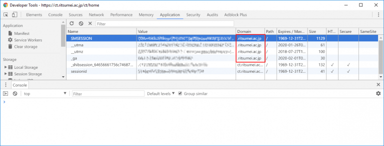
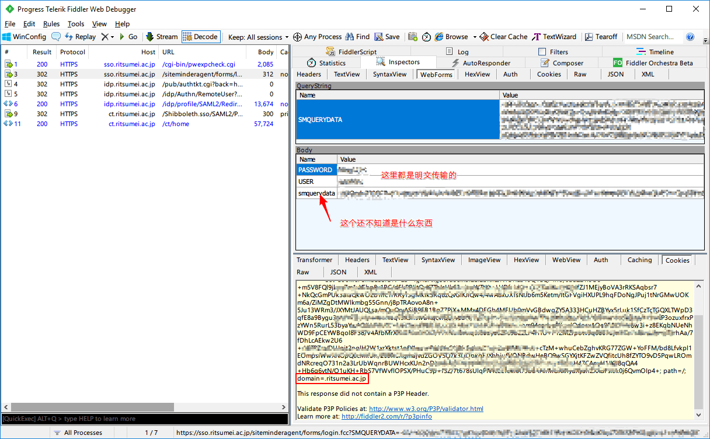

+++
author = "Zhou Fang"
title = "nobo 开发日记（一）"
date = "2018-02-03"
updated = "2018-02-03"
category = "开发手札"
tags = [
    "nobo",
    "Python",
    "爬虫",
]
+++

# 开篇
立命馆现在能用的校内 App 只有一个用 ionic 开发的版本，速度慢，界面卡，实在是用不下去了。
计划中的 RitsFun 是一个适用于立命馆大学的校内 App，作为个人练手项目，将使用 Swift 4.0 开发。
在开发过程中，我会将开发的详细步骤和代码放在日记之中，供各位参考。

而「nobo」则是该软件的后端部分，将负责数据的获取，转储。
<!--more-->

# 分析登陆逻辑
这一次，我打算从登陆逻辑分析开始，先想方设法获取到个人的一些数据。
立命馆大学的网络服务大概是这样：
统一认证系统 RAINBOW ID
┣━ Asahi manaba 
┣━ Ritsumeikan Univ. Campus Web (2018) 
┣━ Ritsumeikan Univ. Syllabus 
┣━ Microsoft Office 365 
┣━ Cisco AnyConnect 
┗━ Windows/CentOS Auth

由于前三个都是通过一个域名，即 `idp.ritsumei.ac.jp` 跳转进行验证。
且登陆一个服务后，切换到其他服务时，并不需要进行再次认证。
故可猜测：登陆后产生了一个跨域的 Cookies。
通过 Chrome 自带的开发者工具进行查看，果真如此。

接着，用 Fidder 进行 HTTPS 抓包分析。

所以，只要写一个 Python 爬虫，应该就能在获取一次 Cookie 的情况下获取到全部信息。