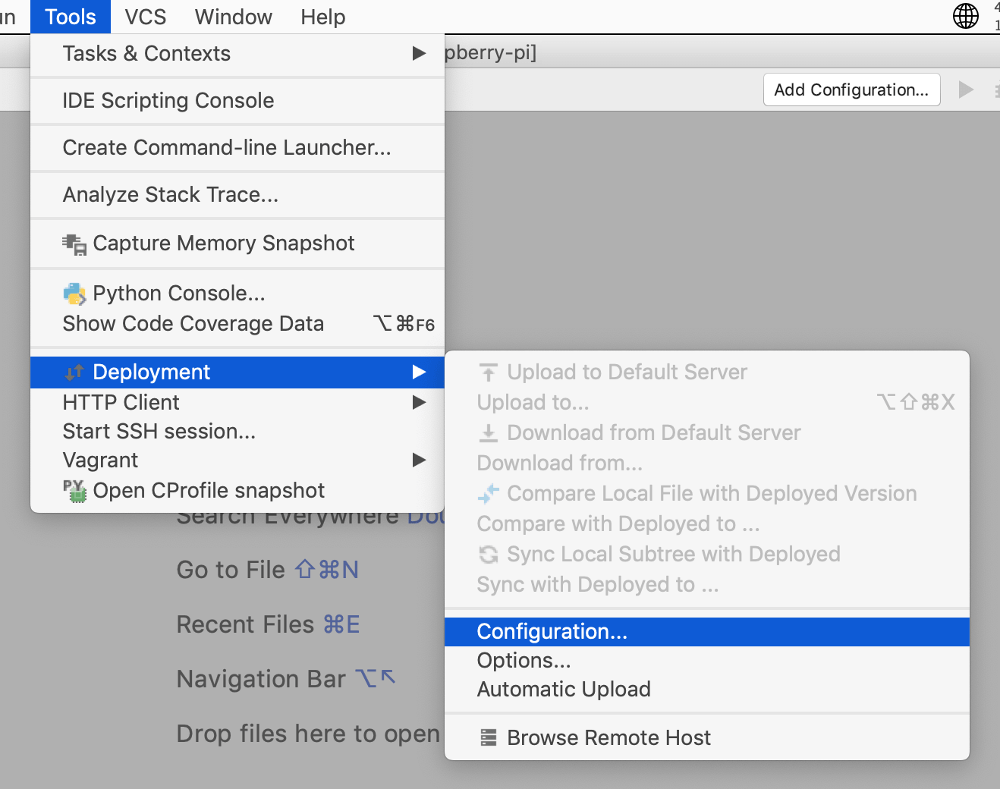
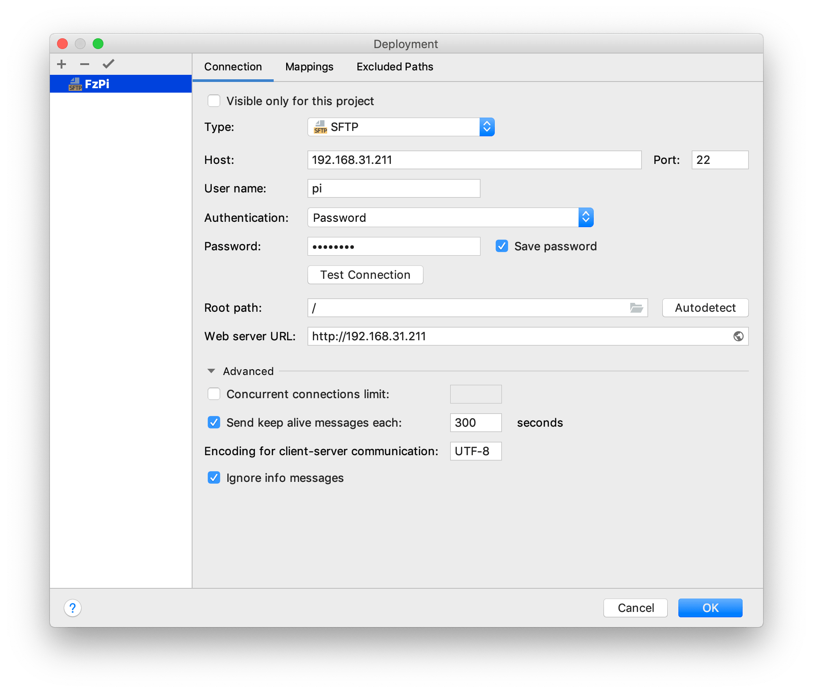
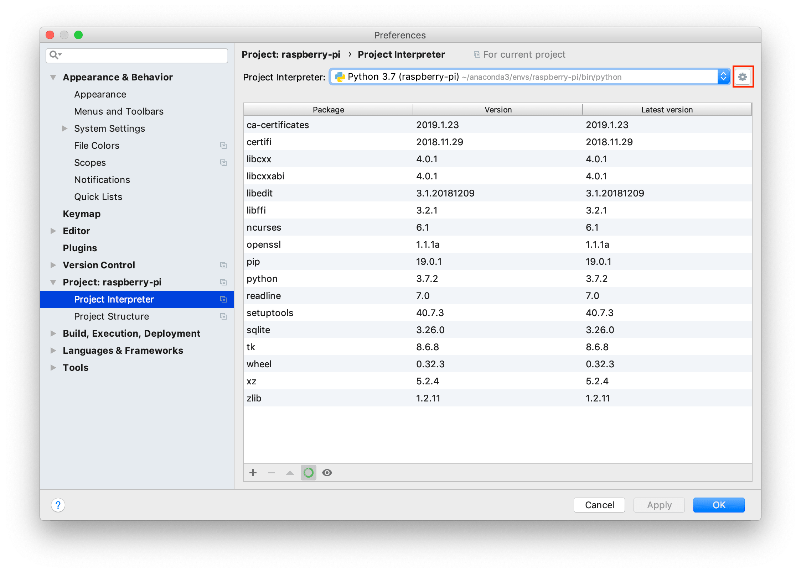
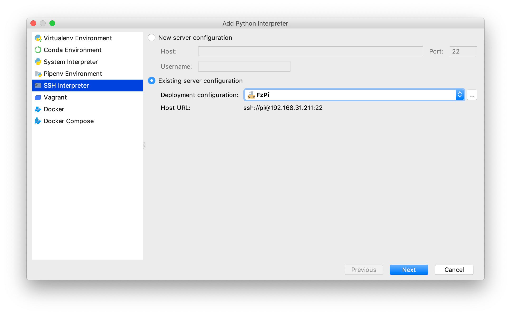
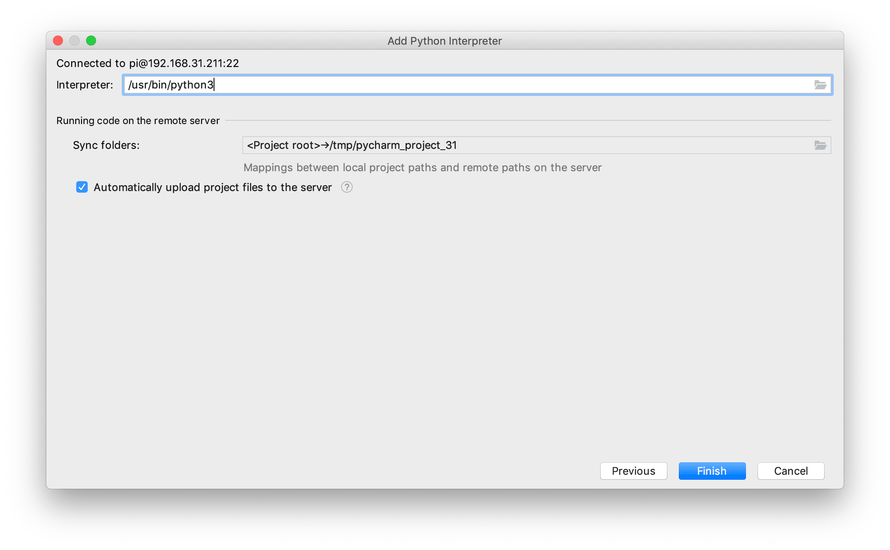
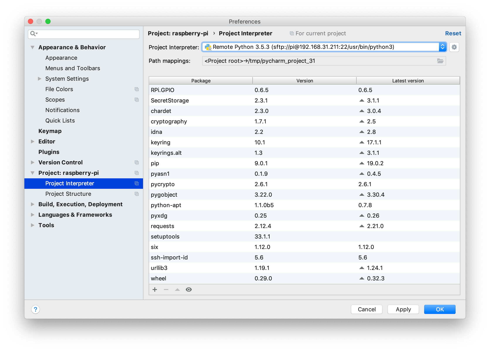
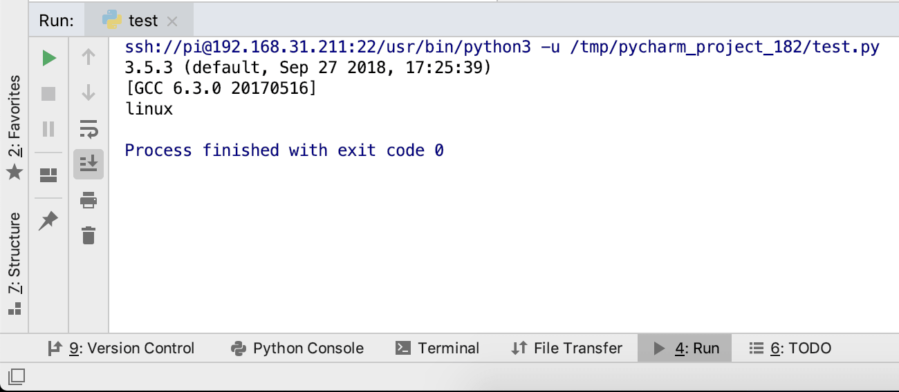

+++
author = "Zhou Fang"
title = "树莓派搞机日记（一）"
date = "2019-02-10"
updated = "2019-02-10"
category = "树莓派"
tags = [
    "Raspberry Pi",
]
+++

# 关于搞机日记
今天开始，我将在这里更新我对于树莓派应用的一些心得。既是我的一个备忘，也希望能成为看到本文的朋友的一个参考手册。

至于阅读难度，我想应该不会很高的。我本身对物理并不是特别的擅长，对于每个部件也仅仅是知道大概的原理，如果让我详细解释部件内部构成，我是一定说不出来的。搞机日记将主要从涵盖部件的选择，硬件连接，软件控制方面来展开，侧重于应用。

# 硬件选择
虽然搞机日记是针对树莓派撰写的，但还是想在这里给有兴趣的朋友讲一些开发板的选择。树莓派（Raspberry Pi）是一款用于学习的开发板，现在社会上已经有非常多面向少儿的兴趣班就是用树莓派进行教学。我在树莓派 3B 型号刚出的时候在日亚购入过一块，作为微型服务器使用，主要特点还是功耗较低。此外，其他厂商也有树莓派的兼容开发板，如华硕的 `Tinker`，但基本上就是简单的硬件堆叠，入门的话简单便宜的板子更好。
<!-- more -->
我在本科三年的下学期修了 Arduino 开发的入门课程，可谓是打开了我 IoT 设备研究开发的大门。如果刚开始研究 IoT 设备入门，或是自己想结合一些部件来搭建自己的硬件平台，很多人就会在树莓派及 Arduino 这两款主流设备间踱步。诚然，两款设备都是非常适合初学者入门的，下面我将列举一些不同点供大家参考选择自己最适合的硬件。

## Arduino 的特点
- 价格亲民，非常适合第一次尝试硬件开发的同学试水。
- 基于 C++ 加强的 Arduino 语言，官方提供多平台的 IDE。
- 运行速度很快，有比较多的安全保证措施防止烧坏。
- 官网提供完善的文档及范例，且一直更新基于 Arduino 优秀项目。

## 树莓派的特点
- 可以安装完整的 Linux 于树莓派上，强大的软件环境支持。
- 提供更加简单的 Python GPIO 库，让开发时间大大缩短。
- 不需要在别的机器上对程序进行预编译。
- 在复杂环境下可运行更大规模的程序。
- 自带了 USB 借口，网线接口，蓝牙，WiFi 模块，耳机接口。
- 支持 HDMI 直接输出。

树莓派带来的是更大的空间，更加完善的环境，但是对于无 Linux 基础的朋友来说，选择从 Arduino 上手可能更好。

# 树莓派开发环境的配置
## 基础配件
1. 树莓派 × 1
2. 电源线 × 1
3. microSD 卡 × 1
4. 一个有 WiFi 的环境，或者网线接入。

**选购建议**
- 开发学习的话，数据卡 16GB 非常够用了。
- 如果只是通过插在电脑的 USB 口供电的话，在大功率使用的时候可能会不太行。

## 系统安装
前文也已经提过了，树莓派内安装的是一个完整的 Linux（当然了 Windows 10 IoT 也可以），之后的日记将基于树莓派的官方 Linux 发行版 `Raspbian` 展开。你可以通过我的 [另外一篇文章]() 来了解如何安装。

## 远程开发
### 远程执行编辑器
按照上一步的教学，现在已经可以通过 `ssh` 连接到树莓派了。你可以直接通过在树莓派上直接运行 `vim` 或是 `emacs` 来高效的书写代码。这是最佳方案，但并不是适合每个人的。后文的方法虽然在配置上需要一点时间，但会大大方便我们之后的开发。

### PyCharm 专业版
古语有云，工欲善其事，必先利其器。学习树莓派也是一样的，PyCharm 就是我们的利器。PyCharm 是 JetBrains 公司开发的一款 IDE，分为社区版本和专业版本，需要注意的是**社区版本无法远程调试**。不过有幸的是，专业版本可以通过在校学生邮箱免费索取使用授权。
[PyCharm 下载地址](https://www.jetbrains.com/pycharm/download/) [JetBrains 学生](https://www.jetbrains.com/student/)

-----

1. 在确认树莓派已经开启 SSH 功能的情况下，在 PyCharm 创建一个项目。

2. 待 PyCharm 项目创建好之后，点击菜单栏中的 `Tools` - `Delopyment` - `Configuration...`。
   

3. 添加一个 `SFTP` 类型的设置，填写好树莓派地址，端口，账户，密码信息后，测试连接一下。
   

4. 打开 Pycharm 的 Preferences，可从屏幕左上角 PyCharm 下拉菜单开启。Windows 和 Linux 下叫做 Setting，在菜单栏的 `File` 中。
   进入项目专用的 `Python Interpreter` 设置，通过窗口右上角的小齿轮 `Add...` 添加一个新的远程解释器。
   

5. 选择 `SSH Interpreter`，由于刚才已经做好了部署设定，现在可以直接选择。
   注意，此处可能有询问是复制一份还是用 IDE 的设定，其实差别不大，我习惯直接用 IDE 设定。
   

6. 如果打算用 Python 3 作为解释器，这里要稍微改动一下路径，如果打算用 Python 2，则直接下一步。
   

7. 确认一下已安装的 Python 软件包。
   `RPi.GPIO` 库是树莓派控制电子端口的库，如果没有的话，可以通过列表下方的 + 号安装之。
   你也可以导入其他的常用库。
   

8. 最后，通过执行代码确认是否现在真的由树莓派的 Python 在编译。
在项目中新建一个 Python 文件，并导入以下代码。

```python
import sys

print(sys.version)
print(sys.platform)
```

从菜单栏中 `Run`，或是用左下的绿色小箭头运行看一下结果，如果如下，说明环境配置好了。


**至此，PyCharm 将可直接调用树莓派上的 Python 来进行编译运行，大大方便了我们的学习。**