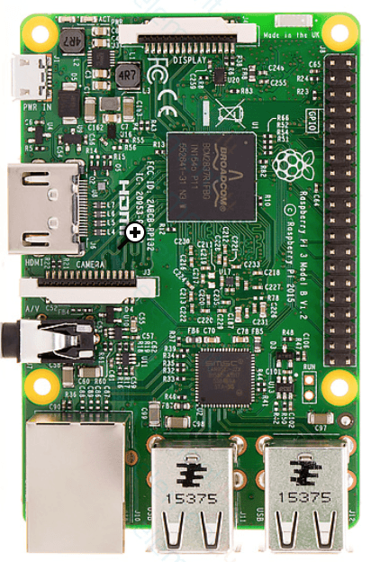
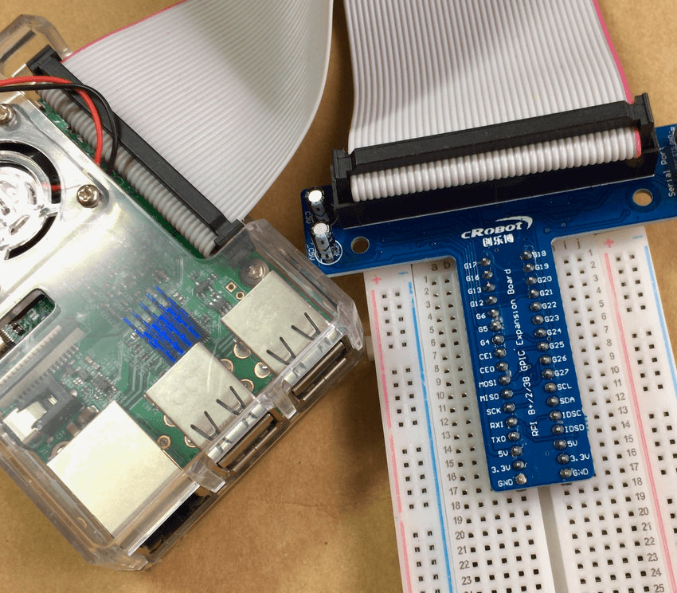
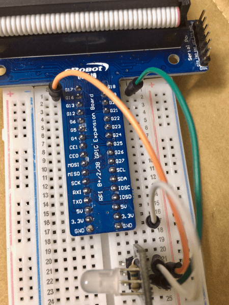
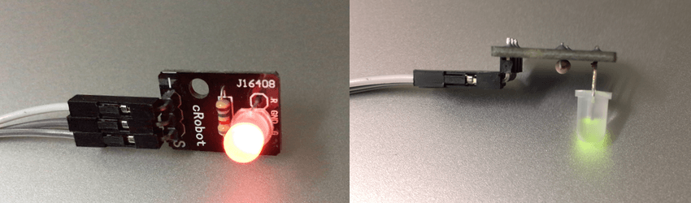

+++
author = "Zhou Fang"
title = "树莓派搞机日记（二）"
date = "2019-02-11"
updated = "2019-02-11"
category = "树莓派"
tags = [
    "LED",
    "Raspberry Pi",
]
+++

# 初识树莓派
树莓派的元件都在表面，没有什么好特殊介绍的，自己上手翻着看一会应该就能对它熟悉了。这里想花点笔墨说下树莓派的针脚。
树莓派的针脚排布是有点混乱的，要辨识针脚，首先，请你按照下图的方向可以举起你手中的树莓派。



<!-- more -->
然后我们打开 [Raspberry Pi Pinout](https://pinout.xyz)，在这个页面上，你可以清晰的看到各个针脚代表的编码。
而树莓派有 3 种不同的模式来约束针脚的使用：
1. **RPi.GPIO.BOARD** 完全按照 `1, 2, 3, ...` 这样顺序排列的。
2. **RPi.GPIO.BCM** 针脚图上写着 `BCM 1`，`BCM 2` 这样的。
3. **WiringPi**（类 Arduino）[专用针脚图](https://pinout.xyz/pinout/wiringpi)

使用上全凭使用者的喜好，个人喜欢 BCM 一点。

`RPi.GPIO` 库可以通过下面的命令来安装
```shell
sudo pip3 install RPi.GPIO
```

`WiringPi` 库可以通过下面的命令来安装：
```shell
sudo pip3 install WiringPi
```
`WiringPi` 的 Python 使用者应该读一下 [项目的 Github 主页](https://github.com/WiringPi/WiringPi-Python)。
其实不光是针脚的使用方式了，就连函数调用都和 Arduino 非常相似。~~高仿~~

如果像我一样比较懒，可以去购买一块带有标识板子，插在面包板上也方便连接。



# 推荐库
**GPIO Zero**，一个 GPIO 增强库，包含了非常多的预设功能，如 LED，按钮，电机控制等等。
在带有桌面环境的 `Raspbian` 已经自带，如果是使用命令行版本的用户，可以通过下面命令安装。
```shell
sudo pip3 install gpiozero
```

安装后在命令行输入 `pinout`，你就会发现一个命令行版本的针脚图。
关于此库更多的功能我将会在之后的搞机日记中展开。

# 双色 LED 实验
## 元件介绍
LED 是非常简单的电子元件，适合我们用于第一次进行正式的树莓派学习。

首先，我先介绍一下我的双色 LED 元件，支持发出红色和绿色光。



从图中可以看到，该元件有三个针脚。最接近 `-` 的针脚代表该针脚接地。右边两个针脚分别对应 R，G，属于 Singal 针脚，缩写为 `S`。

## 连接方式：
采用比较简单的连接方式：
1. 橙色线代表 `R` 针脚，接入 `BCM 17`
2. 绿色线代表 `G` 针脚，接入 `BCM 18`
3. 白色线代表 `GND` 针脚， 接入 `GND`



## 范例代码 01
首先我们得让我们的 LED 亮起来，原理非常简单，只要给相应针脚一个高电压即可。
这是第一次代码范例，注释会尽量详细一点。如果对 Python 不熟悉的话，通过下面的代码注释应该有一些启发，只要能理解这次的流程，那么后面就不是很难了。毕竟，Python 封装了非常多的实用库，主要还是流程细节的设计。

```python
# 导入 GPIO 库
import RPi.GPIO as GPIO

# 定义用于 LED 的针脚 BCM 编号
LED_R = 17
LED_G = 18

# 设定针脚编号为 BCM 模式
GPIO.setmode(GPIO.BCM)

# 设定 LED 针脚可用于输出
GPIO.setup(LED_R, GPIO.OUT)
GPIO.setup(LED_G, GPIO.OUT)

# 关于 __name__ == "__main__"：
# 如果是直接运行本代码，而不是其他 Python 代码调用本文件的话，则会执行
if __name__ == "__main__":
    try:
        while True:
            # 给两个针脚电压
            GPIO.output(LED_R, GPIO.HIGH)
            GPIO.output(LED_G, GPIO.HIGH)
    except KeyboardInterrupt:
        # 检测到中断信号后，关闭 GPIO 通道以供下次使用
        GPIO.cleanup()
        # 退出返回状态代码 6
        exit(6)
```

## 范例代码 02
通过上一节，我们已经可以通过常规的方式进行点灯了，但如果只是这样的话太单调了，接下来我们尝试让双色 LED 进行颜色渐变。
这里，我打算用 `PWM`（脉宽调制，Pulse Width Modulation）方法来控制两个 LED 的明暗。

```python
import RPi.GPIO as GPIO
import time

LED_R = 17
LED_G = 18

GPIO.setmode(GPIO.BCM)

GPIO.setup(LED_R, GPIO.OUT)
GPIO.setup(LED_G, GPIO.OUT)

pwm_r = GPIO.PWM(LED_R, 2000)
pwm_g = GPIO.PWM(LED_G, 2000)

GPIO.output(LED_R, GPIO.LOW)
GPIO.output(LED_G, GPIO.LOW)

pwm_r.start(0)
pwm_g.start(100)

if __name__ == "__main__":
    try:
        while True:
            for i in range(100):
                pwm_r.ChangeDutyCycle(i)
                pwm_g.ChangeDutyCycle(100 - i)
                time.sleep(.25)

            for i in range(100):
                pwm_r.ChangeDutyCycle(100 - i)
                pwm_g.ChangeDutyCycle(i)
                time.sleep(.25)
    except KeyboardInterrupt:
        pwm_r.stop()
        pwm_g.stop()
        GPIO.cleanup()
        exit(6)
```

## 总结


通过运行代码实例不难看出，双色 LED 在混色上效果其实并不好，但是纯红色或是纯绿色的表现很好，这也是这类双色 LED 多用作状态指示灯的原因之一。关于混色，其实还得靠 RGB 三色 LED 来实现。关于 RGB 三色 LED 的简单实验，我将在下一篇日记之中继续介绍。