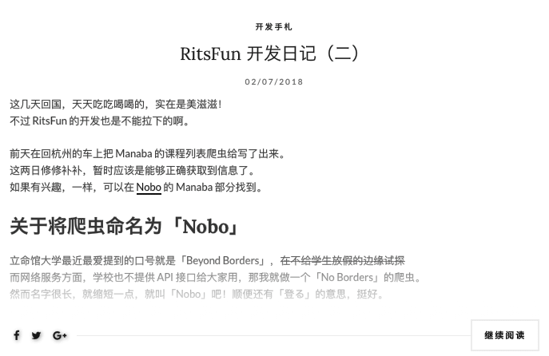

+++
author = "Zhou Fang"
title = "巧用 CSS 遮罩层暗示点击继续阅读"
date = "2018-01-10"
updated = "2018-01-10"
category = "网站建设"
tags = [
    "CSS",
    "网站优化",
]
+++

__注__: 文章是在之前用 WordPress 作为博客程序的时候写的。

# 起因

前几日，当我将博客分享给朋友时，被问道「你的文章怎么都只有一段的啊？」。
没错，在设计时尽量缩小了「继续阅读」按钮，就是为了不影响整体版面的美观。但往往，事与愿违，用户真正在阅读网站时可能并不会注意到不起眼的阅读按钮。
我这里也就抛砖引玉，提供一个我的思路来提示用户这并不是全文。
  
<!--more-->

# 思考
总体思路那一定是在文字上做手脚，但是也不能影响到用户的阅读体验。使用轻微渐变的遮罩层是一个不错的选择。
随着渐变颜色的加深，字慢慢的变得不再清晰，甚至模糊起来。同时，~~让用户知道并不是他撸多了~~，突出旁边清晰的「继续阅读」按钮，吸引其点击之。

# 实现
首先必然是在 HTML 文件里建立一个 div 了，一般来说是在文字的下面。
```html
<div class="my-mask"></div>

然后我们将这个设定一下 CSS 部分的代码。
为了适配主流浏览器，background 需要设定 3 次。

.my-mask {
	position: relative;
	background: -moz-linear-gradient(bottom,rgba(255,255,255,.1),rgba(255,255,255,0));
	background: -webkit-gradient(linear,0 top,0 bottom,from(rgba(255,255,255,0)),to(#fff));
	background: -o-linear-gradient(bottom,rgba(255,255,255,.1),rgba(255,255,255,0));
	width: auto;
	height: 200px;
	margin-top: -200px;
}
```

这里高度设定了 200 像素，你可以自己调整。当然别忘了，要同时修改 margin-top 把遮罩层给拉上去。
效果如下
