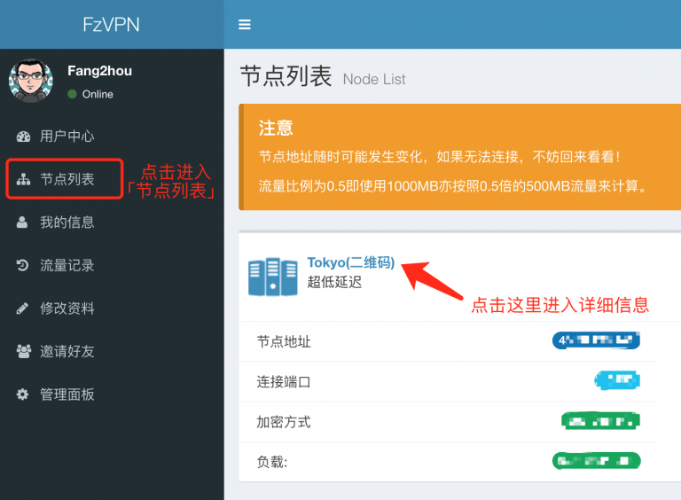
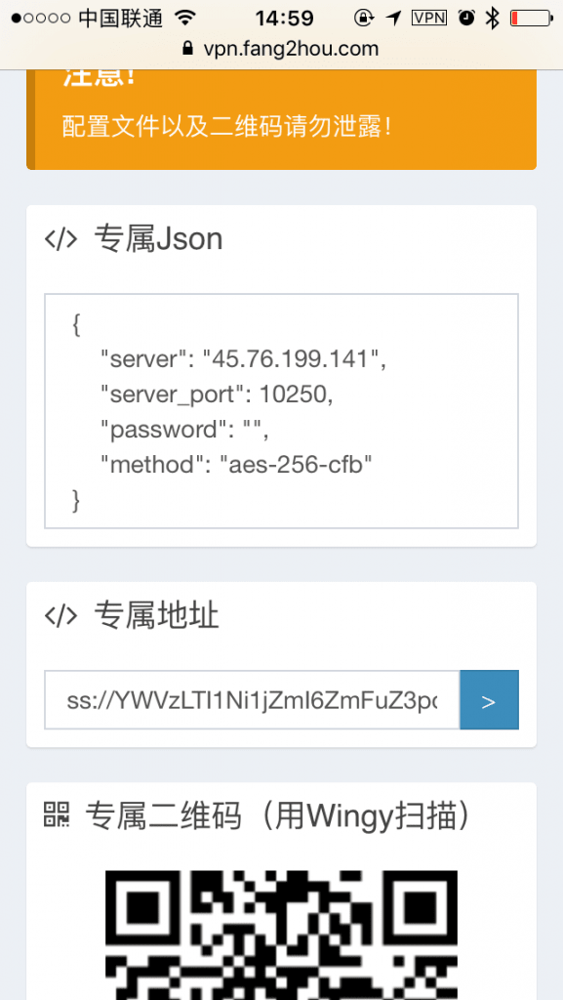
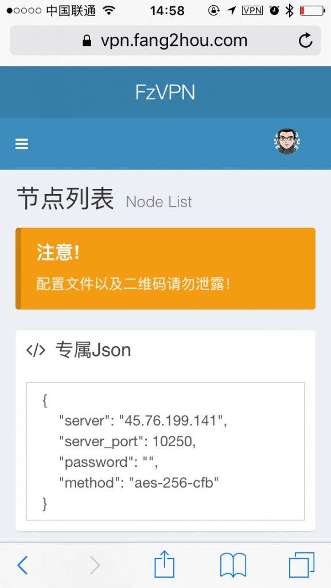

+++
author = "Zhou Fang"
title = "在 iOS 上使用 Shadowsocks"
date = "2017-02-03"
updated = "2018-02-02"
category = "通信网络"
tags = [
    "iOS",
    "Shadowsocks",
]
+++

# 写在教程之前
本教程是通用的 Shadowsocks 在 iOS 上的使用教程。
您可以随时通过访问 [IP111](http://ip111.cn) 来检测您是否成功出国成功。

<!--more-->

# 下载应用
## 苹果商店地区为中国
请通过 App Store 下载「FirstWingy」。
实测无法全部流量通过节点发送，仅支持智能模式（即国内网站全部直连，需要翻的时候自动连接节点）
不是很影响使用，推荐国区用户用这个版本就够了。

## 苹果商店地区为海外
0. 你可以选择上面提到的这个「FirstWingy」，它是免费的。
1.「Wingy」- 曾经的免费客户端王者
**需要注意的是，该软件目前是收费的，但是价格不贵，日区价格为 120 日元（≈ 6.5 元）。**
2. 「Shadowrocket」
**如果你对网络知识有一定了解**，我非常推荐你使用 Shadowrocket 这款软件，其售价约为 20 元。
但是功能更加完善，包括去广告，修改 DNS，自定网络环境等等。

# 设定应用
接下来会介绍 3 种不同的方式来设定。

> 难易度由低到高
> 
## 方法 1：QR 码导入
用电脑打开后台（[FzVPN 后台](https://vpn.fang2hou.com/user/a>)）
打开想要连接的节点详细信息。

打开「FirstWingy」点击图标进行扫描。（其他客户端也有扫描按钮，请自行寻找）

扫描后会自动生成配置并连接。
推荐将各个节点都扫描进软件生成配置，如果连接速度不理想可以换用其他节点。

## 方法 2：链接导入
> 在操作前，请保证您已经正确安装「Wingy」或是「Shadowrocket」应用。

用「Safari」登录 [FzVPN 后台](https://vpn.fang2hou.com/user/a>)

点击左上的「三」字形按钮找到节点列表，并进入欲连接节点的详细信息页面。
在下方「专属地址」的右侧有一个蓝色按钮，按下即可自动导入。

## 方法 3：手动填配置</h3> 
「FirstWingy」直接点击界面右上角的 + 号。
「Wingy」选择「Shadowsocks(R)」这个选项。
填入节点列表上的信息，注意加密方式的选择。

| 设置项 | 说明 |
|--------|--------|
| server | 服务器地址 |
| server_port.hash | 端口 |
| password | 密码 |
| method | 加密方式 |

下面是一个示例👇

# 进阶操作
只要导入了配置，连接外网已经不成问题了。
如果你购买了「Shadowrocket」这个款软件，可以继续下面的进阶操作。
操作就不赘述了，自己花点心思研究下，这软件的网络环境相关功能是真的够用了。