+++
author = "Zhou Fang"
title = "在 macOS 上使用 Shadowsocks"
date = "2017-02-04"
updated = "2018-02-04"
category = "通信网络"
tags = [
    "macOS",
    "Shadowsocks",
]
+++

# 写在教程之前
本教程是通用的 Shadowsocks 在 macOS 上的使用教程。

<!--more-->
# 准备
## 下载客户端
Shadowsocks 在 macOS 上的常用客户端为 「ShadowsocksX-NG」。  
你可以通过下面两种方式来进行下载：
适用于大陆用户：[FzVPN 官网下载](https://vpn.fang2hou.com/supportfiles/macos.zip)
适用于海外用户：[项目主页下载](https://github.com/shadowsocks/ShadowsocksX-NG/releases/)

# macOS 设定
如果您的 Mac 系统低于 10.12(macOS Sierra)，那么就可以跳过此部分。
查看系统版本可以通过点击 Mac 屏幕左上的<i class="fa fa-apple"></i>苹果图标，然后选择「关于」选项来查看。
macOS Sierra 及之后的版本之中，苹果关闭了第三方应用的「任何来源」选项。为了使用 Shadowsocks 客户端，我们需要手动开启之。

**该操作会略微降低系统的安全性，但这是必要操作。**

在「终端」（英文即「Terminal」）应用中，输入以下命令。

```bash
sudo spctl --master-disable
```

# 调整系统设置
进入「系统偏好设置」

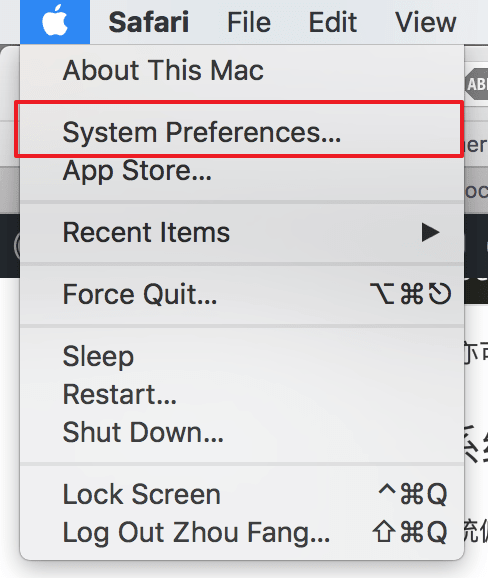

选择「安全性和隐私」进行设定

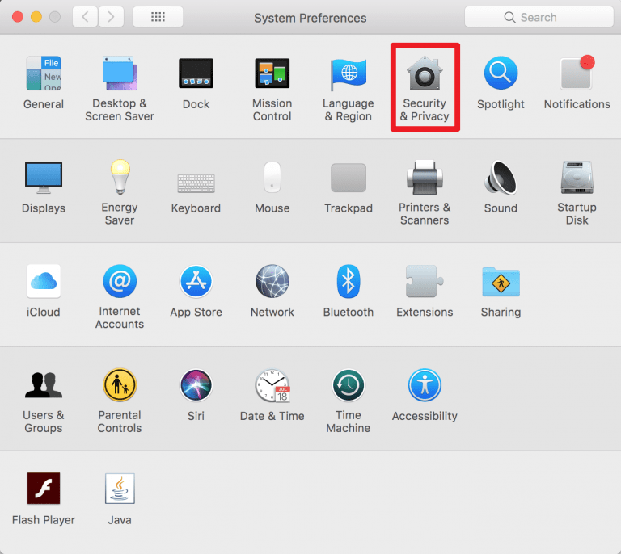

1. 先点击「锁」图标进行解锁
2. 选择「全部来源」选项

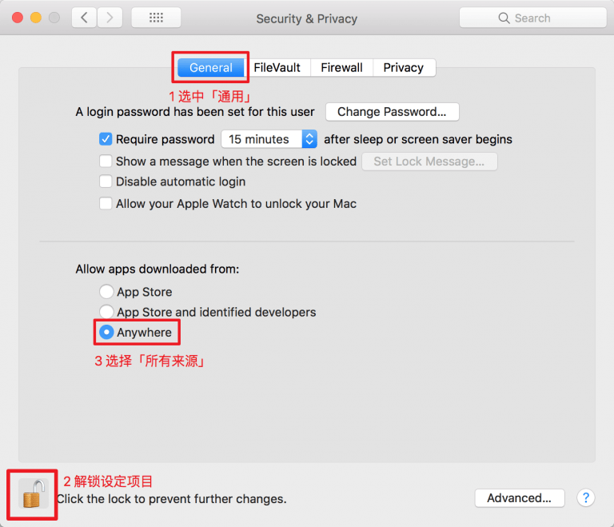

至此，您已经完成所有的准备工作。

## 安装
将下载好的 zip 文件解压至合适的位置。（如果你使用「Safari」浏览器的话，应该已经自动解压了。）
将「ShadowsocksX-NG.app」放入「应用程序（Applications）」文件夹。

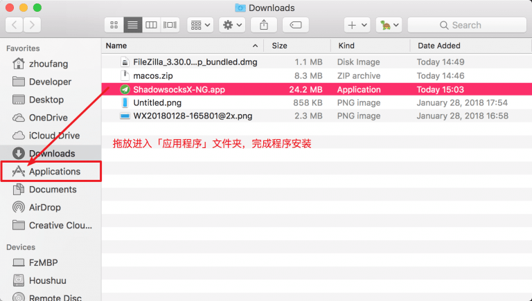

这样，您就已经将 ShadowsocksX-NG 客户端安装好了。
# 配置导入
在「Launchpad」中找到「ShadowsocksX-NG」的图标并启动之。
配图为老版本的「ShadowsocksX-Fz」魔改版本，现在统一使用新版「ShadowsocksX-NG」。

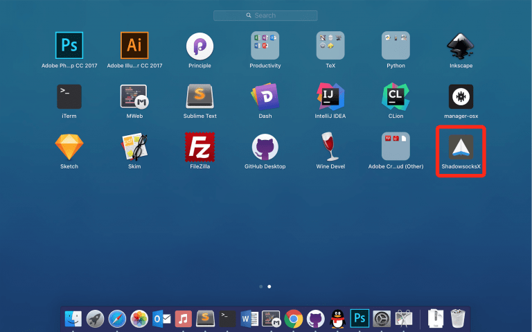

软件全功能详解

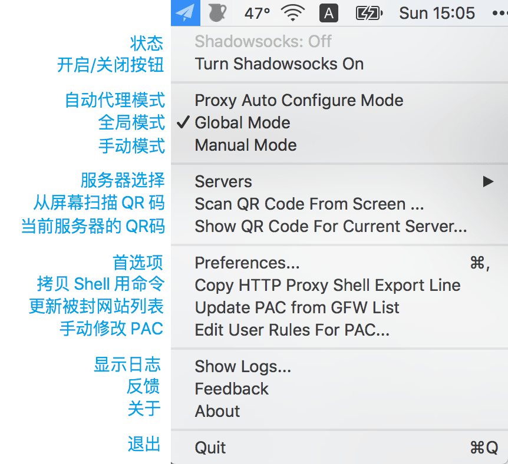

配置地址都在后台的节点列表->详细信息中。

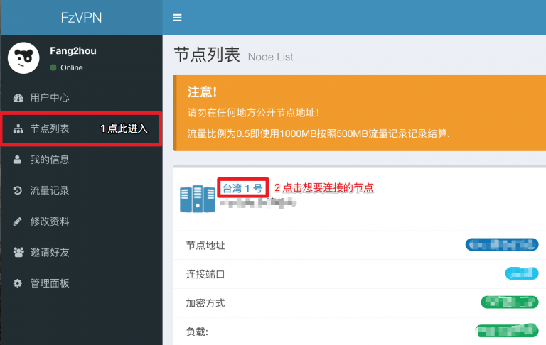

## 链接导入法
打开 FzVPN 的节点信息，点击链接旁的按钮即可。

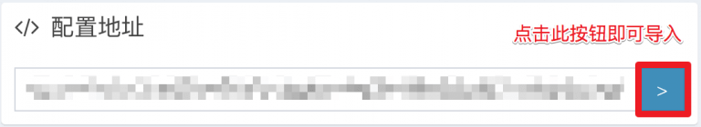

## 二维码法
打开节点信息，并进入到二维码页面。
用自带功能进行扫描。

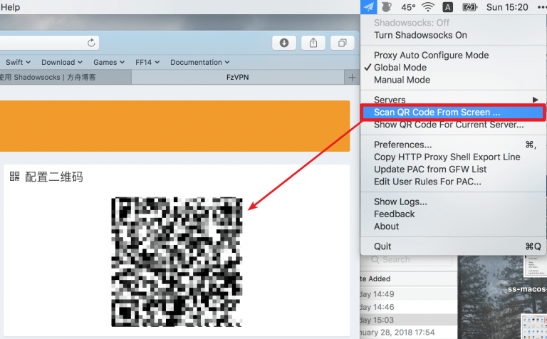

## 手填配置
在以上方法都失效的时候，手动填写配置也可以连接。
从软件打开「服务器」->「打开服务器偏好设置」。

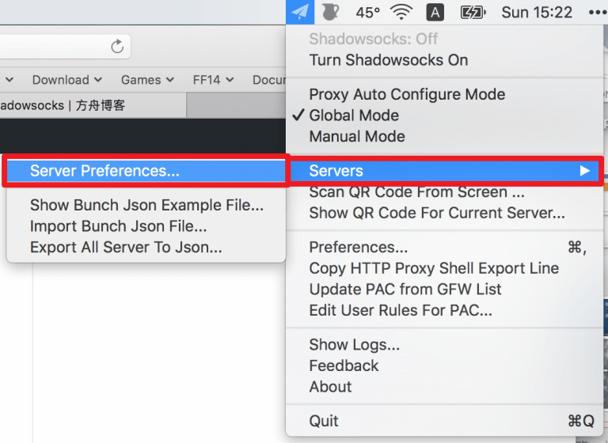

按照后台的信息填写数据即可。

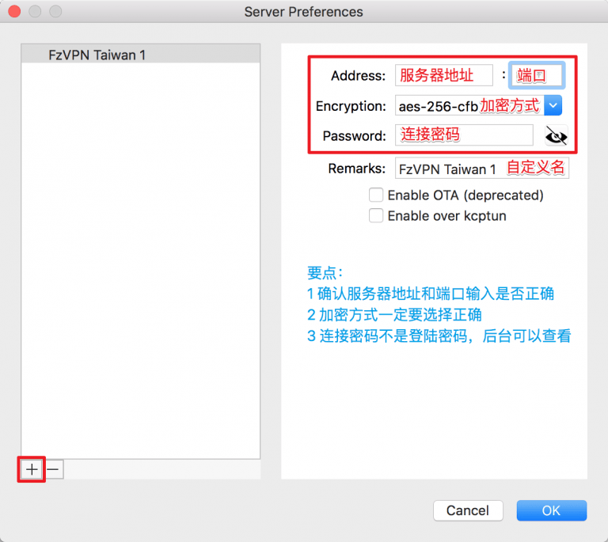

# 连接
> 必须要选择好服务器
> 
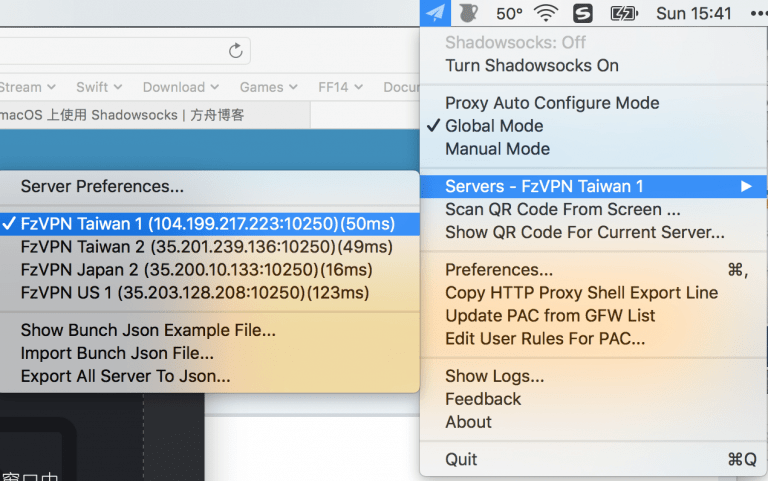
此时，启动 VPN 即可连接到服务器。
