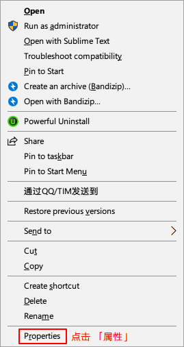

+++
author = "Zhou Fang"
title = "在 Windows 上使用 Shadowsocks"
date = "2017-02-04"
updated = "2018-02-01"
category = "通信网络"
tags = [
    "Windows",
    "Shadowsocks",
]
+++

# 写在教程之前
本教程是通用的 Shadowsocks 在 Windows 上的使用教程。
**下文图片可以点击放大的！**
<!--more-->

# 准备
## 下载客户端
Shadowsocks 在 Windows 上的常用客户端为 「Shadowsocks for Windows」。

你可以通过下面两种方式来进行下载：  
适用于大陆用户：[FzVPN 官网下载](https://vpn.fang2hou.com/supportfiles/win.zip)
适用于海外用户：[项目主页下载](https://github.com/shadowsocks/shadowsocks-windows/releases)

你下载到的应该是一个 zip 压缩文件，请解压到一个目录中使用。初次使用时，软件会在自己的目录下建立相关配置文件。推荐建立一个文件夹，比如叫「Shadowsocks」，然后将程序放在其中执行。

## 设定权限
右键程序，选择「属性」设定。**将软件设定为默认管理员权限启动。**
设定完成后，点击「确定」以退出。

## 导入配置
相关配置信息都在后台的节点列表中。
通过选择节点，可查看该节点您的连接信息。

### QR 码法
右键**托盘图标**，在弹出的菜单中选择「服务器」- 「从屏幕扫描 QR 码」。
约 2 秒钟后，配置将自动生成并加入客户端。

### 手填配置
在 QR 码方法失效的时候，手动填写配置也可以连接。
从软件打开「服务器」->「编辑服务器」。

按照后台的信息填写数据即可。

## 连接 VPN
**必须要选择好节点**

此时，启动 VPN 即可连接到服务器。
点击托盘菜单的第一项，即可开启 VPN。

PAC 模式：国内不通过服务器，直连。
Global 模式：全部流量都走服务器，访问国内网站时速度可能变慢。

到这里，你的代理网络已经建立成功了，但是由于浏览器的设置，你可能需要继续阅读本文。

# 浏览器设定
## 插件安装
市面上有非常多的浏览器，我没法一一讲解，但是对于目前国内市场流行的浏览器而言，都是基于谷歌的 Chromium 项目修改而来，故都能安装代理插件。
  
如果你无法访问谷歌商店进行正常安装，你可以点击 [FzVPN 官网渠道](https://vpn.fang2hou.com/supportfiles/SwitchyOmega.crx) 下载 SwitchyOmega 插件。

下载完成后，打开「扩展程序」，将文件拖入安装即可。

## 代理配置
点击地址栏附近的插件图标，选择 **Option 选项**。

在插件设置的左侧面板中，选择 **New profile 新配置文件**。

随便取个配置名。

依照下图填写相关信息。

点击左侧面板中的 **Apply changes 保存修改**。
  

点击地址栏右侧的插件按钮切换配置。

大功告成，恭喜你，终于又可以自由遨游于互联网。