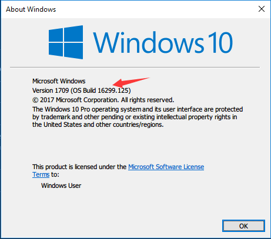
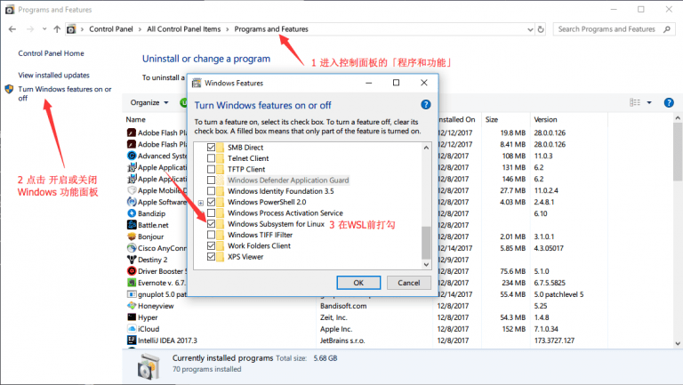
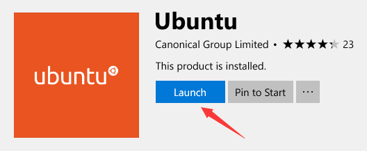
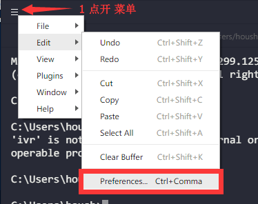
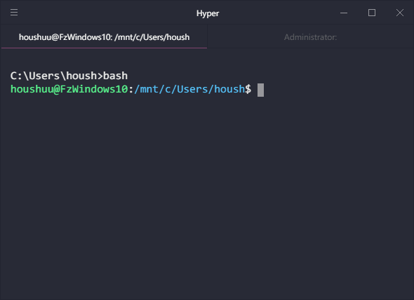
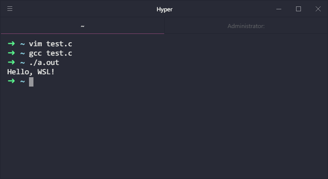

+++
author = "Zhou Fang"
title = "在 Windows 中使用 Linux 子系统"
date = "2017-12-15"
updated = "2017-12-15"
category = "操作系统"
tags = [
    "Linux",
    "子系统",
    "Windows",
]
+++
# 前言
众所周知，Linux 在程序开发时是非常易用的环境。特别对于在日的理工科学生来说，自打从学 C 语言起就是在 Linux 中开发。同时，Mac 对于程序员来说是非常易用的，这得益于 macOS 脱胎于 Unix 系统，大部分 Linux 中常用操作都可以在 macOS 中实现。现在，随着 Windows 系统的进一步发展，在 Windows 10 的周年更新版之后，新增了 Linux 子系统功能。借助子系统，我们可以快速构建一个开发环境，和 Windows 紧密结合在一起。
> 注：我的 PC 搭载的是英文版本的 Windows 10，中文翻译可能不是很准确，请尽量参考截图来操作。
<!--more-->

# 准备
## 系统要求
按住 Win + R 来启动运行（英：Run），执行命令「**winver**」，在弹出的窗口中你就可以看到版本号。



前言中也提到了，子系统的功能特性是在 Windows 10 周年版本后才正式加入的，本文撰写之时，系统已经更新到了 16299 版本。同时，根据官方的 [说明](https://docs.microsoft.com/en-us/windows/wsl/install-win10") 来看，多子系统开始提供于 **Windows 10 版本号 >= 16215**

## 下载并安装 Hyper
Hyper 是一个通过 Web 技术构建的新终端，十分的简洁美观，通过 JSON 形式的配置文件可实现自定义。
你可以通过他们的 [官方网站](https://hyper.is/#installation) 来下载并安装。

# 开启 WSL（Windows Subsystem for Linux）功能
子系统虽然已经被内嵌在了系统之中，但还是需要我们手动去开启的。开启步骤如下图所示。



在开启完后，系统应该会提示让你重新启动，请在重启后回到本页继续阅读。

# 安装内核

如果你已经重启完毕了，我们就可以通过 Windows Store 来安装 Linux 子系统的内核了。
  
[内核的商店页面](https://aka.ms/wslstore)，建议选择 Ubuntu 内核进行安装，下面也会围绕 Ubuntu 内核进行讲解。
在下载完成后，你可以通过商店的**启动**按钮来进行下一步配置。



在接下来的过程之中，系统会询问你希望建立的用户名及密码，需要注意的是，这是用于 Ubuntu 的独立账号密码，**不是系统的账户密码**。

# 配置 Hyper
Hyper 自带界面虽然说不上丑，但是有更多好看的主题。你可以通过 [Hyper 主题网站](https://hyperthemes.matthi.coffee/") 来预览并安装他们。
下面以主题 hyper-snazzy 为例，按照下图操作打开**配置文件**。



在配置文件的尾部可以找到 plugins 的列表，添加插件名如下：
```js
plugins: ["hyper-snazzy"],
```
保存配置文件，重启 Hyper 即可看到效果。

# 进一步配置 Ubuntu
现在，Ubuntu 子系统已经和我们的 Windows 10 合二为一了。为了更加方便的使用和开发，我们还需要进一步配置 Ubuntu。
打开 Hyper，输入「wsl」或是「bash」进入 Ubuntu 子系统。



## 切换软件源服务器到日本
官方的服务器太远了，导致速度非常慢。通过运行以下命令， 你可以将源切换到 [北陸先端科学技術大学院大学](https://www.jaist.ac.jp/index.html) 提供的高速日本国内服务器。
```shell
sudo sed -i.bak -e "s%http://archive.ubuntu.com/ubuntu/%http://ftp.jaist.ac.jp/pub/Linux/ubuntu/%g" /etc/apt/sources.list
```
然后我们执行软件源更新。
```shell
sudo apt-get update
```
接着，将现有软件包全部更新一下。
```shell
sudo apt-get upgrade
```
最后，导入常用的一些开发软件（如 gcc）
```shell
sudo apt-get install build-essential
```
## 测试
试着运行一个简单的 C 程序。



**恭喜，至此常规的配置已经全部完成！**

# 额外的配置
## Oh-my-zsh
<center>用过的人都说好！</center>
Oh-my-zsh 是一个对 zsh 设置大幅简化的工具。而 zsh 则相较于传统的 bash 提供了一个更加易于使用的终端。
在安装 Oh-my-zsh 前，我们先把 zsh 给安装一下。
```shell
sudo apt-get install zsh
```
然后就可以执行下面的命令来安装 Oh-my-zsh
```shell
sh -c "$(curl -fsSL https://raw.github.com/robbyrussell/oh-my-zsh/master/tools/install.sh)"
```
出现 Oh-my-zsh 的字符画或者出现了箭头提示，即为安装成功。


如果你在安装时用了中文输入法，权限认证可能会出错，你可以通过下面的命令来删除，然后重新用上面的安装命令试一次。
```shell
rm -rf ~/.oh-my-zsh
```
在顺利安装完 oh-my-zsh 后，输入以下命令，将默认终端从 bash 修改至 zsh。
```shell
chsh -s $(which zsh)
```
现在开始你可以在常规的命令行中通过运行 **wsl** 命令来打开子系统，并采用 zsh 作为首选。
**bash** 命令依旧可以使用，你甚至可以通过下面的命令来快速运行一些程序（举个例子：vim）
```shell
bash -c vim
```
如果你发现你的终端使用 zsh 有字符错位现象，可以通过更换主题来修正。
用 vim 或是 nano 打开 zsh 的配置文件。为了照顾更多初学者，这里举例为较为简单的 nano。
```shell
nano ~/.zshrc
```
修改主题为 kolo，按下 Ctrl + X 退出，记得输入 Y 确认更改。
```shell
ZSH_THEME="kolo"
```
再次进入 zsh 时，主题会发生改变，从而解决 zsh 错位问题。

# 一些使用技巧
## 关闭烦人的哔哔声
如果一直用 Windows 命令行的话，想必对这个哔哔声早已深恶痛绝，通过下面的设置，可以让子系统 Linux 不再打扰我们。

### Bash 用户
如果你的终端为 bash，那么请使用文本编辑器，如 `vim`，`nano`，`emacs` 或是 GUI 文本编辑器打开 `/etc/inputrc`。**一定要用 Root 权限**，以 `nano` 举例如下。
```shell
sudo nano /etc/inputrc
```

将 `# set bell-style none` 之前的 `#` 删除，使铃声设置为空。

### Zsh 用户
如果你看了我之前的部分，安装了 zsh 终端，那么只需要在 zsh 中执行下面的代码即可。
```shell
unsetopt beep
```