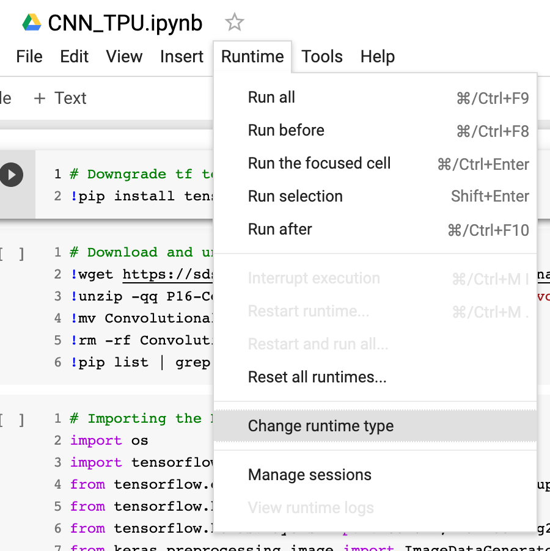

+++
author = "Zhou Fang"
title = "使用 Google Colab 提供的免费 TPU 进行训练"
date = "2019-10-09"
updated = "2019-10-09"
category = "深度学习"
tags = [
    "CNN",
    "Deep Learning",
    "TPU",
]
+++

# 前言
比起深度学习最初的 CPU 计算，现在普遍使用 GPU 来进行训练，效率提升已然是相当明显。但是像是 Google 和阿里巴巴这些科技巨头还是不满足这些，直接让日常使用介入芯片研发，Google 提出 TPU 方案，阿里也成立了平头哥独立品牌来发布新品。官方说法是对于目前顶尖 GPU 都有 20 倍以上的算力提升。
阿里和 Google 的芯片技术都已经实装运用在了自家的云服务上，不过有幸的是，Google 在自家推出的 Colab 机器学习平台之中提供了免费试用 TPU 的机会。这篇文章将会介绍一下当下，快速使用 Keras 进行训练的一个实例。
在看下面的文字的之前，最好回忆一下简单的 CNN 构造。如果你有一些 Keras 或是 TensorFlow 相关的使用经验，那么应该能够非常快速的理解。

<!--more-->
# 配置 Colab 环境
打开 [https://colab.research.google.com](https://colab.research.google.com)，登陆谷歌账户就可以直接启动一个全新的运行实例。
由于是要使用 TPU，所以还要在菜单栏中的 `Runtime` -> `Change runtime type` 手动设定环境为 Python 3，硬件加速为 TPU。



Colab 不但可以承担 Jupyter Notebook 的工作，其实 Google 还为你准备了一个虚拟机。

在撰写本文时，TensorFlow 的正式版本为 1.14，但是我们需要执行的 Keras 支持训练命令(`model.fit_generator`)目前只适配到 1.13，所以先进行降级。
在第一个 Code cell 里填入下面的代码来实现降级，由于要先卸载掉 1.14，得稍微等待一下。

```bash
# Downgrade tf to 1.13.1
!pip install tensorflow==1.13.1
```
在降级成功后，Colab 会在输出之中会提示让你进行一次运行实例重启，点击 `RESTART RUNTIME` 即可。
有时候没有提示的话，就通过 `Runtime` -> `Restart runtime...` 重启。

# 下载数据集

在第二个 Code cell 里填入下面的代码来下载公开的测试数据集（猫狗大战，猫狗各 4000 训练集 + 1000 测试集）。

```bash
# Download and unzip dataset
!wget https://sds-platform-private.s3-us-east-2.amazonaws.com/uploads/P16-Convolutional-Neural-Networks.zip
!unzip -qq P16-Convolutional-Neural-Networks.zip "Convolutional_Neural_Networks/dataset/*"
!mv Convolutional_Neural_Networks/dataset dataset
!rm -rf Convolutional_Neural_Networks
```

# 导入库

这里导入 `os` 库用于 TPU 支持相关语句。
__注意：虽然我们是写 Keras 代码，但这里不能直接使用 `keras` 库中的模型，而是要使用 `tensorflow.keras`。__

```python
import os
import tensorflow as tf
from tensorflow.contrib.tpu.python.tpu import keras_support
from tensorflow.keras.models import Sequential
from tensorflow.keras.layers import Conv2D, MaxPooling2D, Flatten, Dense, Dropout
from keras.preprocessing.image import ImageDataGenerator
```

# 数据集预处理
```python
# Image processing
train_datagen = ImageDataGenerator(rescale=1. /255,
                                   shear_range=0.2,
                                   zoom_range=0.2,
                                   horizontal_flip=True)

test_datagen = ImageDataGenerator(rescale=1. / 255)

train_data = train_datagen.flow_from_directory('dataset/training_set',
                                               target_size=(128, 128),
                                               batch_size=32,
                                               class_mode='binary')

validation_data = test_datagen.flow_from_directory('dataset/test_set',
                                                   target_size=(128, 128),
                                                   batch_size=32,
                                                   class_mode='binary')
```

很容易理解吧，这里的代码主要来自于 Keras 的官方文档。
我打算采用 (128, 128, 3) 的格式输入学习数据，每批个数为 32。你可以根据自己的想法进行调整。 
如果一切顺利，你可以看到下面的输出。

```
Found 8000 images belonging to 2 classes.
Found 2000 images belonging to 2 classes.
```

# 构建网络
一个简单的卷积网络
3 个卷积层，每次都进行池化，全连接层习惯性用2个。

```python
def build_nn():
    # Build the CNN
    model = Sequential()

    model.add(Conv2D(32, (3, 3), padding='same', activation='relu', kernel_initializer='he_uniform', input_shape=(128, 128, 3)))
    model.add(MaxPooling2D(pool_size=(2, 2)))

    model.add(Conv2D(64, (3, 3), padding='same', activation='relu', kernel_initializer='he_uniform'))
    model.add(MaxPooling2D(pool_size=(2, 2)))

    model.add(Conv2D(128, (3, 3), padding='same', activation='relu', kernel_initializer='he_uniform'))
    model.add(MaxPooling2D(pool_size=(2, 2)))

    model.add(Flatten())

    model.add(Dense(256, activation='relu'))
    model.add(Dropout(0.2))

    model.add(Dense(128, activation='relu'))
    model.add(Dropout(0.2))

    model.add(Dense(1, activation='sigmoid'))
    
    return model
```

# 初始化 TPU 环境
先取得 TPU 的位置，这套用法基本上是固定的，每次要用的时候 copy-paste 就行。

```python
# Initialize TPU
tpu_grpc_url = "grpc://"+os.environ["COLAB_TPU_ADDR"]
tpu_cluster_resolver = tf.contrib.cluster_resolver.TPUClusterResolver(tpu_grpc_url)
strategy = keras_support.TPUDistributionStrategy(tpu_cluster_resolver)
```

成功运行的话，可以看到，显示返回到了地址，然后从地址去获取设备信息，1 Worker 8 Core 的 TPU。注意这个数字，因为这意味之后测试集需要组成 batch 为 8 的倍数才能传入。

```
INFO:tensorflow:Querying Tensorflow master (grpc://10.110.24.138:8470) for TPU system metadata.
INFO:tensorflow:Found TPU system:
INFO:tensorflow:*** Num TPU Cores: 8
INFO:tensorflow:*** Num TPU Workers: 1
INFO:tensorflow:*** Num TPU Cores Per Worker: 8
INFO:tensorflow:*** Available Device: _DeviceAttributes(/job:worker/replica:0/task:0/device:CPU:0, CPU, -1, 14991867850935745303)
INFO:tensorflow:*** Available Device: _DeviceAttributes(/job:worker/replica:0/task:0/device:XLA_CPU:0, XLA_CPU, 17179869184, 4977701856257024240)
INFO:tensorflow:*** Available Device: _DeviceAttributes(/job:worker/replica:0/task:0/device:TPU:0, TPU, 17179869184, 799391477980569210)
INFO:tensorflow:*** Available Device: _DeviceAttributes(/job:worker/replica:0/task:0/device:TPU:1, TPU, 17179869184, 7413645770321013063)
INFO:tensorflow:*** Available Device: _DeviceAttributes(/job:worker/replica:0/task:0/device:TPU:2, TPU, 17179869184, 12127959108352401067)
INFO:tensorflow:*** Available Device: _DeviceAttributes(/job:worker/replica:0/task:0/device:TPU:3, TPU, 17179869184, 9301267841357501458)
INFO:tensorflow:*** Available Device: _DeviceAttributes(/job:worker/replica:0/task:0/device:TPU:4, TPU, 17179869184, 2329118821990200537)
INFO:tensorflow:*** Available Device: _DeviceAttributes(/job:worker/replica:0/task:0/device:TPU:5, TPU, 17179869184, 6102181154716035854)
INFO:tensorflow:*** Available Device: _DeviceAttributes(/job:worker/replica:0/task:0/device:TPU:6, TPU, 17179869184, 6202014608559033004)
INFO:tensorflow:*** Available Device: _DeviceAttributes(/job:worker/replica:0/task:0/device:TPU:7, TPU, 17179869184, 7250002334323814010)
INFO:tensorflow:*** Available Device: _DeviceAttributes(/job:worker/replica:0/task:0/device:TPU_SYSTEM:0, TPU_SYSTEM, 8589934592, 16188795321964965491)
```

# 训练前的准备
终于到了要训练的时候，不过注意，TPU 的模型不同于 GPU 和 CPU 的模型关系，TPU 模型需要特殊的转换才能跑，而且模型也会损失掉部分方法，之前我们降级实际上就是为了使用在 1.14 中目前不支持的函数。相信之后 TPU 的时候会越来越方便，毕竟现在还处于发展初期。

```python
# Convert cpu model to tpu model
myOptimizer = tf.keras.optimizers.SGD(lr=0.01, momentum=0.7)
my_cnn = build_nn()
my_cnn.compile(optimizer=myOptimizer, loss='binary_crossentropy', metrics=['accuracy'])
my_cnn = tf.contrib.tpu.keras_to_tpu_model(my_cnn, strategy=strategy)
```

这段代码中有个非常容易被忽视的点，那就是optimizer必须使用到 TensorFlow 的，而不是 Keras 的，否则就会报错哦！我这里使用的是 `Adam` 算法，这里特别说下，常用的随机梯度下降（SGD）目前在 TensorFlow 中映射到 keras 支持模块，不能直接拿来用。

```python
# Convert CPU model to TPU model
myOptimizer = tf.train.AdamOptimizer()
my_cnn = build_nn()
my_cnn.compile(optimizer=myOptimizer, loss='binary_crossentropy', metrics=['accuracy'])
my_cnn = tf.contrib.tpu.keras_to_tpu_model(my_cnn, strategy=strategy)
```

执行成功的话就会看到下面的文字：

```
WARNING:tensorflow:tpu_model (from tensorflow.contrib.tpu.python.tpu.keras_support) is experimental and may change or be removed at any time, and without warning.
```

# 训练，咖啡时间
`epoch` 要多少自己看着设定，第一轮训练其实是较慢的，第二次开始时，速度比起传统 GPU 训练可以说是非常之快速了。

```python
# Train!
my_cnn.fit_generator(train_data,
                     steps_per_epoch=8000,
                     epochs=10,
                     validation_data=validation_data,
                     validation_steps=2000)
```

# 保存权重
尽量不要直接使用保存全网络的函数，保存权重即可。
测试可以在本地构建一个 CPU 模型导入权重来进行测试。

```python
classifier.save_weights('weights.h5', overwrite=True)
```

# 结论
专用硬件训练网络体验真的很棒！只是现在外部软件支持还没有做的很好，但是足以让人期待之后的表现的。
深度学习从几年前的实装困难，到现在简单几句就能开始训练，确确实实从学术界普及到了日常生活之中。很多初学者手上没有足够的硬件导致学习效率低下，相信随着芯片技术的发展，这个问题将不复存在。
